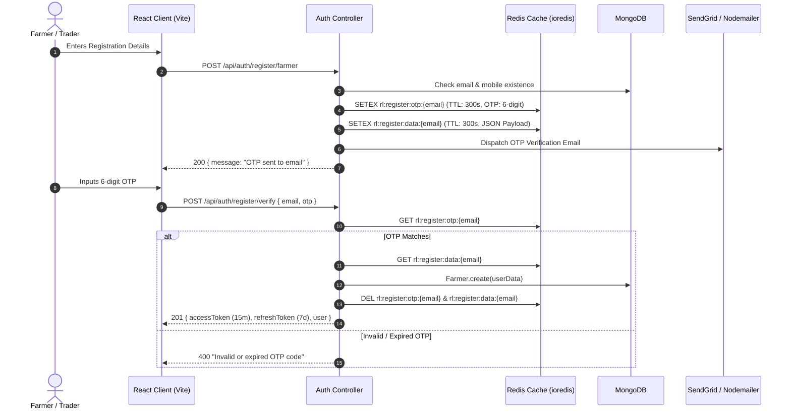
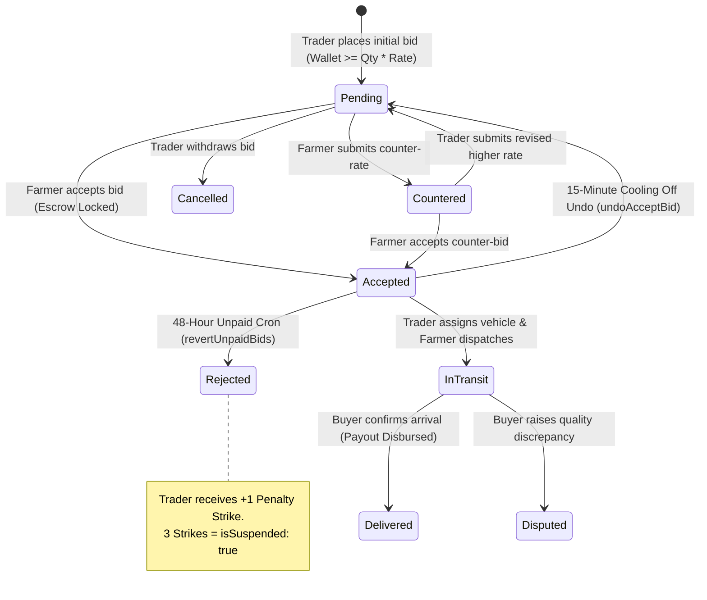
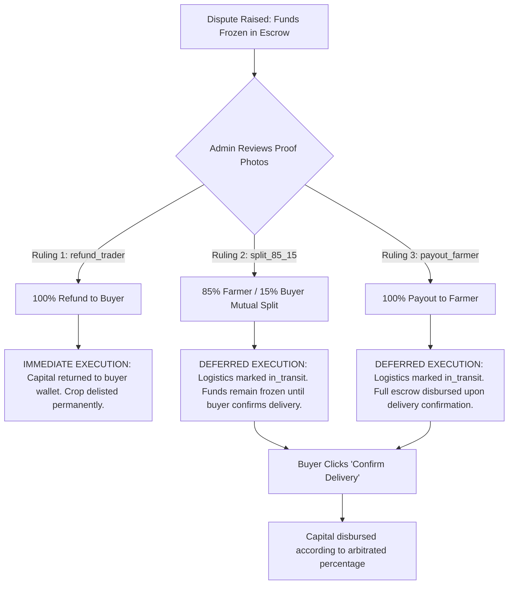
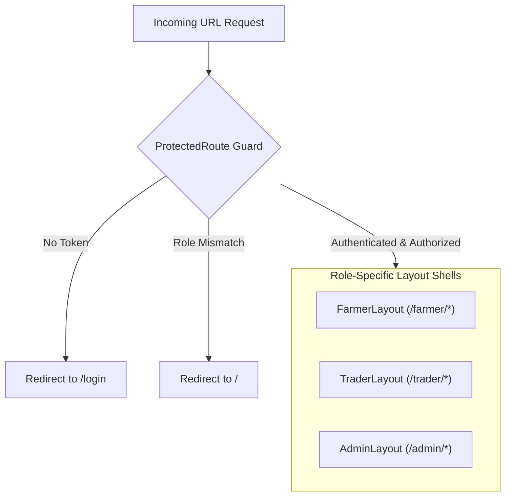

# KRISHISETU: ARCHITECTURAL SPECIFICATION & TECHNICAL KNOWLEDGE BASE
> **System Classification**: Direct-to-APMC Agritech Marketplace, Escrow Settlement Engine & Market Intelligence Platform  
> **Target Jurisdiction**: Karnataka, India (31 Agro-Climatic Districts)  
> **Source-of-Truth Status**: Verified against active repository implementation (`/backend`, `/frontend`, `/models`, `/services`, `/controllers`)  
> **Repository Root**: `r:/PLACEMENTS/KrishiSetu`  
> **Document Purpose**: Complete engineering master reference, product rationale, architectural blueprints, state machines, API catalogue, and AI context prompt.

---

## TABLE OF CONTENTS
1. [Executive Summary & Problem Statement](#1-executive-summary--problem-statement)
2. [Complete Technology Stack & Runtime Matrix](#2-complete-technology-stack--runtime-matrix)
3. [High-Level System Architecture & Topology](#3-high-level-system-architecture--topology)
4. [Monorepo Codebase & Directory Structure](#4-monorepo-codebase--directory-structure)
5. [Database Models & Complete Schema Dictionary](#5-database-models--complete-schema-dictionary)
6. [Dual API Routing & Versioning Architecture](#6-dual-api-routing--versioning-architecture)
7. [Comprehensive API Endpoint Directory](#7-comprehensive-api-endpoint-directory)
8. [Authentication, Authorization & Session Lifecycle](#8-authentication-authorization--session-lifecycle)
9. [Financial Ledger, Wallet & APMC Escrow Engine](#9-financial-ledger-wallet--apmc-escrow-engine)
10. [Bidding, Negotiation & 48-Hour Reversion Engine](#10-bidding-negotiation--48-hour-reversion-engine)
11. [Logistics, Transporter Assignment & Delivery Lifecycle](#11-logistics-transporter-assignment--delivery-lifecycle)
12. [APMC Dispute Arbitration & Resolution State Machine](#12-apmc-dispute-arbitration--resolution-state-machine)
13. [Live Agmarknet Mandi Pricing & Data.gov.in Integration](#13-live-agmarknet-mandi-pricing--datagovin-integration)
14. [Real-Time WebSocket Engine & Push Notifications](#14-real-time-websocket-engine--push-notifications)
15. [Geospatial Intelligence & Cold Storage Discovery](#15-geospatial-intelligence--cold-storage-discovery)
16. [Dual-Layer Agro-Climatic Weather Intelligence](#16-dual-layer-agro-climatic-weather-intelligence)
17. [Background Task Scheduling & BullMQ Worker Pipeline](#17-background-task-scheduling--bullmq-worker-pipeline)
18. [Media Asset Pipeline & Cloudinary Storage Engine](#18-media-asset-pipeline--cloudinary-storage-engine)
19. [Multilingual SMS Engine & Twilio Telemetry](#19-multilingual-sms-engine--twilio-telemetry)
20. [Security Engineering, Rate Limiting & Input Sanitization](#20-security-engineering-rate-limiting--input-sanitization)
21. [Frontend State Architecture, Routing & Role Guards](#21-frontend-state-architecture-routing--role-guards)
22. [Design System, APMC Emerald Palette & Micro-Interactions](#22-design-system-apmc-emerald-palette--micro-interactions)
23. [Edge Cases, Distributed Race Conditions & Self-Healing Behaviors](#23-edge-cases-distributed-race-conditions--self-healing-behaviors)
24. [Developer Operational Playbook & Local Setup](#24-developer-operational-playbook--local-setup)
25. [Technical Viva Defense & System Interview Guide](#25-technical-viva-defense--system-interview-guide)
26. [Claude AI Master Context Prompt](#26-claude-ai-master-context-prompt)

---

## 1. EXECUTIVE SUMMARY & PROBLEM STATEMENT

### 1.1 The Agricultural Reality in Karnataka APMC Markets
In traditional Indian agriculture (specifically regulated under Karnataka APMC bylaws), smallholder farmers face severe market friction:
1. **Middleman Cartelization**: Intermediary commission agents (*dalals*) extract 15% to 25% margins while controlling price discovery.
2. **Information Asymmetry**: Farmers sell produce without real-time knowledge of mandi price spikes in neighboring districts (e.g., selling tomatoes at ₹12/kg in Hassan when Mysuru APMC trades at ₹24/kg).
3. **Payment Defaults & Exploitation**: Post-delivery non-payment or unilateral price renegotiation by buyers once harvest arrives at the yard (*post-harvest distress selling*).
4. **Logistics Failures & Transit Spoiling**: Lack of verified transporter assignment leading to spoilage of perishables before yard arrival.
5. **Arbitration Gridlock**: No transparent digital paper trail for disputes regarding produce grade, moisture levels, or vehicle delivery discrepancies.

### 1.2 The KrishiSetu Solution
**KrishiSetu** (Agricultural Bridge) is an enterprise-grade digital platform engineered to eliminate predatory intermediaries, guarantee settlement through RBI-compliant escrow simulation, stream live Government APMC market telemetry, and facilitate transparent bilateral negotiations.

```
[Smallholder Farmer] <== Direct Digital Contract ==> [Licensed Trader / Bulk Buyer]
                                ||
                        [APMC Escrow Vault]
                        (Funds Frozen on Acceptance)
                                ||
              +-----------------+-----------------+
              |                                   |
    [Logistics & Transporter]          [APMC Dispute Arbiter]
    (Vehicle Photo + Driver UTR)       (85/15 Split / 100% Payout / Delist)
```

---

## 2. COMPLETE TECHNOLOGY STACK & RUNTIME MATRIX

| Layer | Technology | Version | Purpose in KrishiSetu | Verification Status in Codebase |
|---|---|---|---|---|
| **Backend Runtime** | Node.js | `>= 20.x` | High-throughput asynchronous event loop | Active (`backend/server.js`) |
| **API Framework** | Express.js | `5.2.1` | Next-generation REST API runtime with native promise error handling | Active (`package.json`) |
| **Database** | MongoDB + Mongoose | `9.6.3` | Document datastore with schema enforcement, geospatial indexing & transactions | Active (`config/db.js`, `models/`) |
| **In-Memory Cache & Lock** | Redis (`ioredis`) | `5.11.1` | Distributed cache, OTP TTL, user suspension sets, Socket.io broadcast adapter | Active (`config/redis.js`) |
| **Resilient Cache Fallback** | `ioredis-mock` | `8.13.1` | High-performance in-memory mock when cloud Redis is offline | Active (`config/redis.js`) |
| **Task Queue** | BullMQ | `5.79.2` | Distributed recurring cron orchestration (repeatable jobs) | Active (`jobs/cronJobs.js`, `workers/cronWorker.js`) |
| **Real-time WebSockets** | Socket.io | `4.8.3` | Dual-room verified messaging, live bid updates, real-time toast alerts | Active (`server.js`) |
| **Socket Clustering** | `@socket.io/redis-adapter` | `8.3.0` | Multi-instance cross-process WebSocket broadcast synchronizer | Active (`server.js`) |
| **Payment Gateway** | Razorpay SDK | `2.9.6` | Order generation, HMAC-SHA256 signature verification with dev sandbox bypass | Active (`controllers/transactionController.js`) |
| **Media Cloud CDN** | Cloudinary v2 | `1.41.3` | Crop photo, transporter truck photo & dispute evidence upload | Active (`middleware/uploadMiddleware.js`) |
| **Multer Storage** | `multer-storage-cloudinary` | `4.0.0` | Stream multipart form files straight to dynamic Cloudinary folders | Active (`middleware/uploadMiddleware.js`) |
| **SMS Telemetry** | Twilio SDK | `6.0.2` | Multi-lingual SMS price broadcasts to farmer mobile numbers | Active (`services/twilioService.js`) |
| **Weather Telemetry (Server)** | OpenWeatherMap API | External REST | Severe agro-climatic risk evaluation (wind, rain, squall) | Active (`services/weatherService.js`) |
| **Weather Telemetry (Client)** | Open-Meteo & IMD Radars | External REST | 31-District 7-day agro-climatic micro-forecast without rate limits | Active (`frontend/src/services/weatherService.js`) |
| **API Documentation** | Swagger / OpenAPI 3.0 | `6.3.0` / `5.0.1` | Interactive documentation served at `/api-docs` | Active (`config/swagger.js`, `server.js`) |
| **Security Headers** | Helmet | `8.2.0` | HTTP header protection with CSP adjusted for asset loads | Active (`server.js`) |
| **Rate Limiting** | `express-rate-limit` | `8.5.2` | Global (5000 dev / 100 prod), OTP (5 / 15 min), Admin (5 / hr) limiters | Active (`middleware/rateLimiter.js`) |
| **Injection Defense** | `express-mongo-sanitize` | `2.2.0` | Prohibits MongoDB operator injection (`$gt`, `$where`) | Active (`server.js`) |
| **Frontend Framework** | React 19 | `19.2.8` | Next-gen declarative view engine with transitions | Active (`frontend/package.json`) |
| **Build & Dev Tool** | Vite | `8.2.2` | Ultra-fast ESM development server and Rollup production bundler | Active (`frontend/vite.config.js`) |
| **Client Routing** | React Router DOM | `7.18.2` | Nested layouts, data loaders, protected route hierarchies | Active (`frontend/src/AppRoutes.jsx`) |
| **Styling & Theme** | Tailwind CSS | `3.4.19` | Utility-first CSS configured with custom APMC Emerald/Slate palette | Active (`frontend/tailwind.config.js`) |
| **UI Components** | Radix UI Slot + Lucide | `1.3.3` / `1.34.0` | Accessible headless primitives & modern agricultural SVG icons | Active (`frontend/package.json`) |
| **Data Visualization** | Recharts | `3.10.1` | Responsive charts for Mandi price fluctuation & admin revenue analytics | Active (`frontend/package.json`) |

---

## 3. HIGH-LEVEL SYSTEM ARCHITECTURE & TOPOLOGY

```mermaid
flowchart TB
    subgraph Clients["User Surface (Browser / Mobile PWA)"]
        F[Farmer Dashboard / Mobile]
        T[Trader Escrow Terminal]
        A[APMC State Admin Portal]
        P[Public Portal / Mandi Feed]
    end

    subgraph Gateway["Express 5 Reverse Gateway (:5000)"]
        H[Helmet Security & Sanitization]
        RL[Distributed Rate Limiter]
        AUTH[JWT Verification & Redis O(1) Suspension Filter]
        ROUTER[Dual Router: /api & /api/v1]
    end

    subgraph Controllers["Business Domain Controllers"]
        AC[Auth & OTP Controller]
        CC[Crop Listing Controller]
        BC[Bidding & Negotiation Controller]
        TC[Transaction & Escrow Controller]
        WC[Wallet Ledger Controller]
        DC[APMC Dispute Controller]
        PC[Mandi Price Controller]
        MC[Messaging & Chat Controller]
    end

    subgraph RealTime["Real-Time Event Fabric"]
        SIO[Socket.io Server]
        RAD[Redis Adapter Pub/Sub]
        SE[Internal Node EventEmitter]
    end

    subgraph DataPersistence["Primary Storage & Memory"]
        MONGO[(MongoDB Replica Set)]
        REDIS[(Redis Cache & BullMQ)]
    end

    subgraph ExternalIntegrations["External Telemetry & Cloud Partners"]
        DGOV[Data.gov.in Agmarknet API]
        RZP[Razorpay Escrow Gateway]
        CLD[Cloudinary Media CDN]
        TWL[Twilio SMS Gateway]
        METEO[Open-Meteo & OpenWeather]
    end

    F & T & A & P --> H --> RL --> AUTH --> ROUTER
    ROUTER --> AC & CC & BC & TC & WC & DC & PC & MC
    BC & TC & MC --> SE --> SIO
    SIO <--> RAD <--> REDIS
    Controllers --> MONGO
    Controllers --> REDIS
    PC -.-> DGOV
    TC -.-> RZP
    CC & TC & DC -.-> CLD
    Controllers -.-> TWL
    F & PC -.-> METEO
```

---

## 4. MONOREPO CODEBASE & DIRECTORY STRUCTURE

```
KrishiSetu/
├── backend/
│   ├── config/
│   │   ├── bullmq.js             # BullMQ Queue & Worker connection setup
│   │   ├── db.js                 # Mongoose connection with reconnect retry logic
│   │   ├── redis.js              # ioredis client with seamless in-memory fallback
│   │   └── swagger.js            # OpenAPI 3.0 specification definition
│   ├── controllers/
│   │   ├── adminController.js    # Statistics, suspension, APMC arbitration, audits
│   │   ├── authController.js     # OTP issuance, verification, JWT dual-token issuance
│   │   ├── bidController.js      # Bidding, counter-offers, 15-min undo, acceptance
│   │   ├── cropListingController.js # Multi-photo listings, category filter, delisting
│   │   ├── exportController.js   # CSV streaming export of transactions
│   │   ├── farmerController.js   # Farmer profile & dashboard statistics
│   │   ├── messageController.js  # P2P messaging with chat history
│   │   ├── notificationController.js # Read/unread push alerts
│   │   ├── priceController.js    # Agmarknet prices, 10% alert scans, commodity trends
│   │   ├── schemeController.js   # Government welfare scheme registry
│   │   ├── smsController.js      # Twilio manual broadcast trigger
│   │   ├── storageController.js  # MongoDB 2dsphere geospatial cold storage lookup
│   │   ├── traderController.js   # Trader verification & company profile
│   │   ├── transactionController.js # Escrow locks, vehicle assignments, delivery payouts
│   │   └── walletController.js   # Sandbox top-ups, idempotency, ledger inspection
│   ├── jobs/
│   │   └── cronJobs.js           # Schedules BullMQ repeatable cron tasks
│   ├── middleware/
│   │   ├── authMiddleware.js     # Bearer JWT decode & O(1) Redis suspension rejection
│   │   ├── errorMiddleware.js    # Catch-all 404 & unified JSON error formatter
│   │   ├── rateLimiter.js        # Global, OTP, and Admin-specific rate gates
│   │   ├── uploadMiddleware.js   # Cloudinary dynamic multi-folder & disk fallback
│   │   └── validate.js           # express-validator runner
│   ├── models/
│   │   ├── Admin.js              # System administrators
│   │   ├── AuditLog.js           # Regulatory compliance log
│   │   ├── Bid.js                # Bids, counter-offers & negotiation histories
│   │   ├── ColdStorage.js        # 2dsphere geo-indexed storage locations
│   │   ├── Conversation.js       # P2P conversation threads
│   │   ├── Crop.js               # Agricultural harvest lots
│   │   ├── Dispute.js            # APMC arbitration records & evidence
│   │   ├── Farmer.js             # Farmer profiles with district enum
│   │   ├── GovernmentScheme.js   # Welfare schemes with moderation states
│   │   ├── MandiPrice.js         # Compound-indexed APMC commodity rates
│   │   ├── Message.js            # Individual chat messages
│   │   ├── Notification.js       # User notifications
│   │   ├── Report.js             # Flagged listings
│   │   ├── Review.js             # Mutual ratings
│   │   ├── Scheme.js             # Legacy scheme collection
│   │   ├── Trader.js             # APMC-licensed buyer entity
│   │   ├── Transaction.js        # Financial escrow & logistics contract
│   │   ├── Wallet.js             # Trader capital account
│   │   └── WalletLedger.js       # Immutable financial double-entry ledger
│   ├── routes/
│   │   ├── adminRoutes.js
│   │   ├── authRoutes.js
│   │   ├── bidRoutes.js
│   │   ├── cropListingRoutes.js
│   │   ├── exportRoutes.js
│   │   ├── farmerRoutes.js
│   │   ├── messageRoutes.js
│   │   ├── notificationRoutes.js
│   │   ├── priceRoutes.js
│   │   ├── schemeRoutes.js
│   │   ├── smsRoutes.js
│   │   ├── storageRoutes.js
│   │   ├── traderRoutes.js
│   │   ├── transactionRoutes.js
│   │   └── walletRoutes.js
│   ├── services/
│   │   ├── bidService.js         # 48-Hour unpaid bid auto-reversion & trader penalty
│   │   ├── cropService.js        # Stale crop auto-expiry & harvest reminders
│   │   ├── priceService.js       # Data.gov.in live fetcher & 10% price delta alerts
│   │   ├── schemeService.js      # Web scraper/ingestion for welfare schemes
│   │   ├── twilioService.js      # Multilingual localized SMS dispatcher
│   │   └── weatherService.js     # Server-side agricultural hazard evaluation
│   ├── utils/
│   │   ├── auditEmitter.js       # Async event emitter for regulatory logs
│   │   ├── createNotification.js # Helper writing DB notification + socket emit
│   │   ├── generateToken.js      # 15m Access Token + 7d Refresh Token generation
│   │   ├── karnatakaLocations.js # Canonical 31 Karnataka district constants
│   │   ├── logger.js             # Winston structured logging
│   │   ├── paginate.js           # Universal pagination & projection utility
│   │   ├── seedData.js           # Comprehensive DB seeder with mock data
│   │   ├── smsTemplates.js       # Kannada, English, Hindi SMS dictionaries
│   │   └── socketEmitter.js      # Decoupled socket broadcast event emitter
│   ├── workers/
│   │   └── cronWorker.js         # BullMQ queue processor handling background jobs
│   └── server.js                 # Main HTTP server, Socket.io, middleware, graceful exit
│
├── frontend/
│   ├── src/
│   │   ├── components/
│   │   │   ├── admin/            # AdminLayout, CessAudits, DisputeModals
│   │   │   ├── common/           # Navbar, Footer, ProtectedRoute, PublicLayout
│   │   │   ├── farmer/           # FarmerLayout, ListingCard, CounterBidModal
│   │   │   ├── trader/           # TraderLayout, BidModal, VehicleUploadModal
│   │   │   └── ui/               # Button, Badge, Modal, Tabs, StatCard primitives
│   │   ├── context/
│   │   │   ├── AuthContext.jsx   # User identity, JWT storage, multi-tab sync
│   │   │   └── SocketContext.jsx # Authenticated WebSocket channel manager
│   │   ├── hooks/
│   │   │   ├── useAuth.js        # Consumer hook for AuthContext
│   │   │   ├── useDebounce.js    # Search input debouncer
│   │   │   ├── usePagination.js  # Client page state manager
│   │   │   └── useSocket.js      # Consumer hook for SocketContext
│   │   ├── pages/
│   │   │   ├── admin/            # Dashboard, Users, Disputes, Intelligence, Schemes
│   │   │   ├── auth/             # Login, Register, FarmerRegister, TraderRegister, OTP
│   │   │   ├── farmer/           # Listings, Bids, Orders, Transactions, Weather, Chats
│   │   │   ├── public/           # Landing Home, MandiPrices, Schemes, 404
│   │   │   └── trader/           # Marketplace, CropDetail, Escrow, Orders, Invoices
│   │   ├── services/
│   │   │   ├── api.js            # Axios instance with JWT interceptor & 401 handler
│   │   │   ├── authService.js    # Registration, OTP, token management
│   │   │   ├── bidService.js     # Bidding REST client
│   │   │   ├── cropService.js    # Crop catalog REST client
│   │   │   ├── disputeService.js # Dispute filing & inspection client
│   │   │   ├── escrowService.js  # Wallet balance & top-up client
│   │   │   ├── orderService.js   # Vehicle details & delivery confirmation
│   │   │   ├── priceService.js   # Mandi price search client
│   │   │   └── weatherService.js # Direct Open-Meteo 31-district client
│   │   ├── AppRoutes.jsx         # Full client routing hierarchy
│   │   ├── index.css             # Tailwind base & custom animations
│   │   └── main.jsx              # React DOM root mounting
│   ├── package.json
│   ├── tailwind.config.js
│   └── vite.config.js
```

---

## 5. DATABASE MODELS & COMPLETE SCHEMA DICTIONARY

### 5.1 `Farmer` (`models/Farmer.js`)
*Represents verified agricultural producers in Karnataka.*

| Field | Type | Modifiers / Constraints | Description |
|---|---|---|---|
| `name` | `String` | `required: true`, `index: true` | Farmer's legal full name |
| `mobile` | `String` | `required: true`, `unique: true`, regex `/^\d{10}$/` | 10-digit Indian phone number |
| `email` | `String` | `required: true`, `unique: true`, lowercase, regex email | Unique login identifier |
| `password` | `String` | `required: true`, `minlength: 8`, `select: false` | Bcrypt hashed password (`salt: 10`) |
| `district` | `String` | `required: true`, `enum: KARNATAKA_DISTRICTS`, `index: true` | One of 31 Karnataka districts |
| `village` | `String` | Optional | Rural address |
| `state` | `String` | `default: 'Karnataka'`, `enum: ['Karnataka']` | Enforced state jurisdiction |
| `cropsGrown` | `[String]` | Array of strings | Commodities cultivated (e.g. `['Tomato', 'Onion']`) |
| `landArea` | `Number` | `min: 0` | Acreage owned or leased |
| `sowingSeason` | `String` | Optional | Kharif, Rabi, or Zaid |
| `language` | `String` | `default: 'kn'` | Preferred language code (`kn`, `en`, `hi`) |
| `isActive` | `Boolean` | `default: true` | Soft delete flag |
| `isSuspended` | `Boolean` | `default: false` | Admin suspension state |
| `createdAt` | `Date` | `default: Date.now` | Registration timestamp |

*Pre-save Hook*: Automatically checks `isModified('password')` and hashes via `bcrypt.genSalt(10)`.

---

### 5.2 `Trader` (`models/Trader.js`)
*Represents APMC-authorized buyers and commercial entities.*

| Field | Type | Modifiers / Constraints | Description |
|---|---|---|---|
| `name` | `String` | `required: true` | Primary contact person's name |
| `companyName`| `String` | Optional | Registered business name |
| `licenseNumber`| `String`| Optional | APMC trader/commission license identifier |
| `apmcAffiliation`| `String`| Optional | Primary APMC Yard name (e.g., Yeshwanthpur) |
| `email` | `String` | `required: true`, `unique: true`, lowercase | Login email address |
| `password` | `String` | `required: true`, `minlength: 8`, `select: false` | Bcrypt hashed password |
| `mobile` | `String` | `required: true`, `unique: true`, regex `/^\d{10}$/` | Mobile contact |
| `district` | `String` | `required: true`, `index: true` | Operational base district |
| `state` | `String` | `default: 'Karnataka'` | Operational state |
| `operatingLocations`| `[String]`| Array of strings | Districts where trader procures crops |
| `verificationStatus`| `String`| `enum: ['pending', 'approved', 'rejected']`, `default: 'pending'`, `index: true` | APMC KYC approval state |
| `documents` | `[String]`| Array of URLs | Cloudinary KYC document URLs |
| `penaltyCount`| `Number` | `default: 0` | Accumulator of strikes (suspends at `>= 3`) |
| `isSuspended`| `Boolean`| `default: false` | Locked state preventing bidding & login |
| `isActive` | `Boolean` | `default: true` | Active flag |
| `createdAt` | `Date` | `default: Date.now` | Registration date |

---

### 5.3 `Crop` (`models/Crop.js`)
*Represents an agricultural lot offered on the marketplace.*

| Field | Type | Modifiers / Constraints | Description |
|---|---|---|---|
| `farmer` | `ObjectId` | `ref: 'Farmer'`, `required: true` | Owning producer reference |
| `name` | `String` | `required: true`, text indexed | Commodity name (e.g., 'Sona Masoori Paddy') |
| `category` | `String` | `enum: ['vegetables', 'fruits', 'grains', 'spices', 'pulses', 'other']` | Commodity category |
| `quantity` | `Number` | `required: true`, `min: 0` | Volume available for sale |
| `unit` | `String` | `enum: ['kg', 'quintal', 'tonne']`, `default: 'quintal'` | Unit of measure |
| `basePrice` | `Number` | `required: true`, `min: 0` | Floor price per unit in INR (₹) |
| `district` | `String` | Optional | Harvest location |
| `description`| `String` | Optional | Lot details, moisture content, grade notes |
| `images` | `[String]`| Array of URLs | Photos of the actual harvested crop |
| `status` | `String` | `enum: ['available', 'sold', 'removed', 'delisted', 'expired', 'withdrawn']`, `default: 'available'` | Lifecycle state |
| `harvestStatus`| `String`| `enum: ['pre-harvest', 'post-harvest']`, `default: 'post-harvest'` | Current field state |
| `expectedHarvestDate`| `Date` | `required: when pre-harvest` | Projected harvest date |
| `createdAt` | `Date` | `default: Date.now` | Creation timestamp |

*Compound Indexes*:
- `{ status: 1, category: 1 }`
- `{ farmer: 1, status: 1 }`
- `{ name: 'text' }`

---

### 5.4 `Bid` (`models/Bid.js`)
*Represents a binding financial tender placed on a crop listing.*

| Field | Type | Modifiers / Constraints | Description |
|---|---|---|---|
| `crop` | `ObjectId` | `ref: 'Crop'`, `required: true` | Target agricultural lot |
| `farmer` | `ObjectId` | `ref: 'Farmer'`, `required: true` | Beneficiary farmer |
| `trader` | `ObjectId` | `ref: 'Trader'`, `required: true` | Bidding buyer |
| `amount` | `Number` | `required: true`, `min: 0` | Current active offer rate per unit (₹) |
| `originalAmount`| `Number`| `min: 0` | Initial first bid before counter-negotiations |
| `counterAmount` | `Number`| `min: 0` | Active counter proposal rate |
| `counterProposedBy` | `String`| `enum: ['farmer', 'trader', null]` | Party who submitted current counter |
| `counterMessage` | `String`| Optional | Counter negotiation rationale |
| `negotiationHistory` | `[Object]`| Array of subdocuments | Full audit trail of counter proposals |
| `status` | `String` | `enum: ['pending', 'countered', 'accepted', 'rejected', 'withdrawn', 'withdrawn_by_farmer', 'cancelled', 'disputed', 'dispute_resolved']`, `default: 'pending'` | State machine flag |
| `message` | `String` | Optional | Initial bid note |
| `createdAt` | `Date` | `default: Date.now` | Timestamp |

*Negotiation Subdocument Structure*:
```javascript
{
  proposedBy: { type: String, enum: ['farmer', 'trader'], required: true },
  amount: { type: Number, required: true },
  message: { type: String },
  createdAt: { type: Date, default: Date.now }
}
```

*Indexes*:
- `{ crop: 1, status: 1 }`
- `{ trader: 1, createdAt: -1 }`
- `{ farmer: 1 }`

---

### 5.5 `Transaction` (`models/Transaction.js`)
*The central APMC escrow contract binding money, produce, and logistics.*

| Field | Type | Modifiers / Constraints | Description |
|---|---|---|---|
| `farmer` | `ObjectId` | `ref: 'Farmer'` | Recipient of produce settlement |
| `trader` | `ObjectId` | `ref: 'Trader'` | Buyer funding the contract |
| `cropListing` | `ObjectId` | `ref: 'Crop'` | Linked produce lot |
| `bid` | `ObjectId` | `ref: 'Bid'`, `unique: true` (partial) | Accepted bid record |
| `amount` | `Number` | `required: true`, `min: 0` | Total escrow sum (`quantity * rate`) |
| `paymentStatus` | `String` | `enum: ['pending', 'initiated', 'held_in_escrow', 'completed', 'failed', 'payout_released', 'refunded']`, `default: 'pending'` | Escrow state |
| `logisticsStatus`| `String` | `enum: ['pending', 'in_transit', 'arrived_mandi', 'delivered', 'disputed', 'resolved']`, `default: 'pending'` | Transporter progress |
| `vehicleDetails` | `Object` | Subdocument | Transporter fleet assignment details |
| `dispatchedAt` | `Date` | Optional | Timestamp when farmer handed over crop |
| `deliveredAt` | `Date` | Optional | Timestamp when buyer accepted arrival |
| `paymentMethod` | `String` | `enum: ['razorpay', 'manual']` | Gateway or ledger channel |
| `paymentGatewayId`| `String`| Optional | Razorpay order ID or ledger UTR |
| `receiptUrl` | `String` | Optional | PDF / image invoice link |
| `disputeResolution` | `String` | `enum: ['none', 'refund_trader', 'split_85_15', 'payout_farmer']`, `default: 'none'` | Admin ruling action |
| `disputeResolutionStatus`| `String`| `enum: ['none', 'awaiting_delivery', 'executed']`, `default: 'none'` | Deferred execution state |
| `farmerPayoutAmount`| `Number` | `default: 0` | Final amount disbursed to farmer |
| `traderRefundAmount`| `Number` | `default: 0` | Final amount credited back to buyer |
| `transactionDate` | `Date` | `default: Date.now` | Creation timestamp |

*Vehicle Details Subdocument*:
```javascript
{
  vehicleNumber: { type: String, trim: true }, // e.g. "KA-04-E-8821"
  vehicleType: { type: String, trim: true },   // e.g. "Eicher 19ft"
  capacity: { type: String, trim: true },      // e.g. "10 Tonnes"
  driverName: { type: String, trim: true },
  driverContact: { type: String, trim: true }, // 10 digits
  vehiclePhoto: { type: String, trim: true },  // Cloudinary URL
  additionalNotes: { type: String, trim: true },
  submittedAt: { type: Date }
}
```

*Indexes*:
- `{ farmer: 1, transactionDate: -1 }`
- `{ trader: 1, transactionDate: -1 }`
- `{ paymentStatus: 1 }`
- `{ bid: 1 }` (unique, partial filter: `{ bid: { $exists: true, $type: "objectId" } }`)

---

### 5.6 `Dispute` (`models/Dispute.js`)
*Formal APMC arbitration record filed against a transaction.*

| Field | Type | Modifiers / Constraints | Description |
|---|---|---|---|
| `transaction` | `ObjectId` | `ref: 'Transaction'`, `required: true`, `unique: true` | Disputed escrow contract |
| `trader` | `ObjectId` | `ref: 'Trader'`, `required: true` | Complainant or respondent buyer |
| `farmer` | `ObjectId` | `ref: 'Farmer'`, `required: true` | Complainant or respondent seller |
| `cropListing` | `ObjectId` | `ref: 'Crop'` | Crop under quality inspection |
| `bid` | `ObjectId` | `ref: 'Bid'` | Linked accepted bid |
| `reason` | `String` | `required: true` | Detailed justification of dispute |
| `proofPhotos` | `[String]` | Array of Cloudinary URLs | Photographic evidence of damage/spoilage |
| `escrowAmount` | `Number` | `required: true`, `min: 0` | Total frozen capital under dispute |
| `status` | `String` | `enum: ['raised', 'under_review', 'resolved_refund_trader', 'resolved_split_85_15', 'resolved_payout_farmer', 'rejected']`, `default: 'under_review'` | Arbitration status |
| `ruling` | `Object` | Subdocument | APMC official verdict and capital split |
| `createdAt` | `Date` | `default: Date.now` | Filing date |
| `updatedAt` | `Date` | `default: Date.now` | Resolution date |

*Ruling Subdocument*:
```javascript
{
  action: { type: String, enum: ['refund_trader', 'split_85_15', 'payout_farmer', 'rejected'] },
  notes: { type: String, trim: true },
  farmerPayout: { type: Number, default: 0 },
  traderRefund: { type: Number, default: 0 },
  resolvedAt: { type: Date },
  resolvedBy: { type: mongoose.Schema.Types.ObjectId, ref: 'Admin' }
}
```

---

### 5.7 `Wallet` & `WalletLedger` (`models/Wallet.js`, `models/WalletLedger.js`)
*Double-entry accounting engine ensuring mathematical balance integrity.*

#### `Wallet`:
| Field | Type | Default | Description |
|---|---|---|---|
| `trader` | `ObjectId` | Required, `ref: 'Trader'`, `unique: true` | Trader capital account owner |
| `availableBalance` | `Number` | `0` (`min: 0`) | Unencumbered liquid capital for bidding |
| `lockedBalance` | `Number` | `0` (`min: 0`) | Capital committed to active escrow contracts |
| `totalDeposited` | `Number` | `0` (`min: 0`) | Cumulative lifetime inflows |
| `totalDisbursed` | `Number` | `0` (`min: 0`) | Cumulative lifetime payments to farmers |

#### `WalletLedger`:
| Field | Type | Description |
|---|---|---|
| `trader` | `ObjectId` | Owning trader reference |
| `wallet` | `ObjectId` | Associated wallet container |
| `type` | `String` | `enum: ['TOP_UP', 'BID_LOCK', 'BID_RELEASE', 'ESCROW_LOCK', 'PAYOUT_DISBURSED', 'REFUND']` |
| `amount` | `Number` | Magnitude of capital moved in this entry |
| `balanceAfter` | `Number` | Exact snapshot of `availableBalance` after mutation |
| `status` | `String` | `enum: ['pending', 'completed', 'failed']`, `default: 'completed'` |
| `source` | `String` | e.g. `'DEVELOPMENT_SANDBOX'`, `'APMC_ESCROW_SETTLEMENT'` |
| `paymentMethod` | `String` | e.g. `'Instant NetBanking / UPI'`, `'Direct Benefit Transfer (DBT)'` |
| `utr` | `String` | Unique banking or sandbox transaction reference |
| `description` | `String` | Human-readable audit narrative |
| `referenceId` | `String` | Linked transaction or dispute ID |
| `idempotencyKey`| `String` | Index for 60-second duplicate suppression |
| `createdAt` | `Date` | Ledger creation timestamp |

---

### 5.8 `ColdStorage` (`models/ColdStorage.js`)
*Geospatial registry for post-harvest loss prevention.*

| Field | Type | Description |
|---|---|---|
| `name` | `String` | Warehouse or cold room name |
| `address` | `String` | Street address |
| `district` | `String` | One of Karnataka's 31 districts |
| `capacity` | `Number` | Total capacity in Metric Tons |
| `costPerDay` | `Number` | Rate in ₹ per Quintal/Day |
| `contactNumber` | `String` | Facility manager phone |
| `isGovernmentOwned` | `Boolean`| Karnataka State Warehousing Corp vs Private |
| `location` | `Object` | GeoJSON Point `{ type: 'Point', coordinates: [lng, lat] }` |

*Geospatial Index*: `{ location: '2dsphere' }` (Enables `$near` distance radius queries).

---

### 5.9 `MandiPrice` (`models/MandiPrice.js`)
*Canonical price telemetry scraped from Government of India Agmarknet portals.*

| Field | Type | Description |
|---|---|---|
| `commodity` | `String` | Produce name (e.g., 'Tomato', 'Maize') |
| `variety` | `String` | Sub-species or commercial variety |
| `grade` | `String` | Quality grade (e.g., 'FAQ' - Fair Average Quality) |
| `market` | `String` | Specific APMC yard name (e.g., 'Kolar APMC') |
| `district` | `String` | District name in Karnataka |
| `state` | `String` | Fixed to `'Karnataka'` |
| `minPrice` | `Number` | Minimum transaction rate in ₹/Quintal |
| `maxPrice` | `Number` | Maximum transaction rate in ₹/Quintal |
| `modalPrice` | `Number` | Most frequent wholesale trading price in ₹/Quintal |
| `arrivalDate` | `Date` | Mandi trading session date |
| `unit` | `String` | Default `'Quintal'` |
| `fetchedAt` | `Date` | Ingestion timestamp |

*Compound Unique Index*:
`{ market: 1, commodity: 1, variety: 1, arrivalDate: 1 }` (Ensures idempotent daily ingestion without duplicate records).

---

### 5.10 Other Supporting Schemas
- **`Admin`**: Superusers with bcrypt credentials and access to arbitration and platform analytics.
- **`AuditLog`**: Regulatory log documenting all system actions, actor roles, target IDs, and JSON diffs.
- **`Conversation` & `Message`**: P2P communication channels linking buyer and seller on a specific crop listing.
- **`GovernmentScheme`**: Karnataka & Central welfare schemes with editorial moderation (`pending` -> `published`).
- **`Notification`**: Real-time push alert records with unread tracking (`isRead: Boolean`).
- **`Report`**: Listing grievance complaints (`spam`, `fake_listing`, `fraud`).
- **`Review`**: 1-to-5 star counterparty reputation scores with unique index preventing duplicate reviews.

---

## 6. DUAL API ROUTING & VERSIONING ARCHITECTURE

To ensure backwards compatibility with mobile clients, legacy integrations, and future client iterations, the Express backend registers all routes under **both** `/api/v1` and `/api` prefixes simultaneously in `backend/server.js`:

```javascript
// server.js (Lines 230 - 251)
const registerRoutes = (prefix) => {
  app.use(`${prefix}/auth`, authRoutes);
  app.use(`${prefix}/farmers`, farmerRoutes);
  app.use(`${prefix}/traders`, traderRoutes);
  app.use(`${prefix}/listings`, cropListingRoutes);
  app.use(`${prefix}/crops`, cropListingRoutes); // Alias
  app.use(`${prefix}/bids`, bidRoutes);
  app.use(`${prefix}/prices`, priceRoutes);
  app.use(`${prefix}/mandi`, priceRoutes);       // Alias
  app.use(`${prefix}/schemes`, schemeRoutes);
  app.use(`${prefix}/notifications`, notificationRoutes);
  app.use(`${prefix}/admin`, adminRoutes);
  app.use(`${prefix}/sms`, smsRoutes);
  app.use(`${prefix}/transactions`, transactionRoutes);
  app.use(`${prefix}/storage`, storageRoutes);
  app.use(`${prefix}/messages`, messageRoutes);
  app.use(`${prefix}/export`, exportRoutes);
  app.use(`${prefix}/wallet`, walletRoutes);
};

registerRoutes('/api/v1');
registerRoutes('/api');
```

---

## 7. COMPREHENSIVE API ENDPOINT DIRECTORY

### 7.1 Authentication & Profile (`/api/auth`)
| Method | Route | Auth | Description | Payload Highlights | Responses |
|---|---|---|---|---|---|
| `POST` | `/register/farmer` | Public | Initiates farmer registration & sends 5-min OTP | `{ name, email, mobile, password, district, village }` | `200 OTP sent`, `400 Email/Mobile exists` |
| `POST` | `/register/trader` | Public | Initiates trader registration & sends 5-min OTP | `{ name, email, mobile, password, district, companyName }`| `200 OTP sent`, `400 Validation err` |
| `POST` | `/register/verify` | Public | Verifies registration OTP and creates account | `{ email, otp }` | `201 { user, accessToken, refreshToken }` |
| `POST` | `/login` | Public | Password authentication for Farmers and Traders | `{ email, password }` | `200 { user, accessToken, refreshToken }`, `401` |
| `POST` | `/login/otp` | Public | Initiates passwordless email OTP login | `{ email }` | `200 OTP sent`, `404 User not found` |
| `POST` | `/login/otp/verify` | Public | Verifies login OTP and generates JWT tokens | `{ email, otp }` | `200 { user, accessToken, refreshToken }` |
| `POST` | `/password/forgot` | Public | Sends password reset OTP to user email | `{ email }` | `200 Reset code sent` |
| `POST` | `/password/reset` | Public | Sets new password using verified OTP | `{ email, otp, newPassword }` | `200 Password updated successfully` |
| `POST` | `/admin/login` | Public | Dedicated rate-limited login for administrators | `{ email, password }` | `200 { user, accessToken, refreshToken }` |
| `POST` | `/refresh-token` | Public | Generates new 15-min Access Token from Refresh Token | `{ refreshToken }` | `200 { accessToken }`, `401 Invalid token` |
| `POST` | `/logout` | Public | Clears client session tokens | None | `200 Logged out successfully` |

---

### 7.2 Crop Listings (`/api/listings` or `/api/crops`)
| Method | Route | Auth | Description | Payload Highlights | Responses |
|---|---|---|---|---|---|
| `GET` | `/` | Public | Paginated crop catalog with search, category & district | Query: `?page=1&limit=10&category=vegetables&district=Hassan` | `200 { data, pagination }` |
| `GET` | `/:id` | Public | Detailed view of crop listing including farmer details | None | `200 Crop document`, `404` |
| `POST` | `/` | Protected (`farmer`) | Create new crop lot with up to 5 Cloudinary photos | Multipart: `name`, `category`, `quantity`, `unit`, `basePrice`, `images` | `201 Created crop`, `400` |
| `PUT` | `/:id` | Protected (`farmer`) | Edit listing details or add photos | Multipart / JSON fields | `200 Updated crop` |
| `DELETE`| `/:id` | Protected (`farmer`) | Withdraw or delist crop | None | `200 Listing removed` |

---

### 7.3 Bids & Bilateral Negotiation (`/api/bids`)
| Method | Route | Auth | Description | Payload Highlights | Responses |
|---|---|---|---|---|---|
| `POST` | `/` | Protected (`trader`) | Place bid or increase existing pending bid rate | `{ cropId, amount, message }` | `201 Created / 200 Updated`, `400 Insufficient wallet balance` |
| `GET` | `/listing/:cropId`| Protected | View all competitive bids placed on a crop lot | None | `200 Paginated bids (highest rate first)` |
| `GET` | `/my-bids` | Protected | View user's inbound (farmer) or outbound (trader) bids | Query: `?page=1&limit=10` | `200 Bids populated with linked transactions & disputes` |
| `PUT` | `/:id` | Protected (`trader`) | Increase pending bid price | `{ amount, message }` | `200 Bid rate updated` |
| `DELETE`| `/:id` | Protected (`trader`) | Cancel pending bid before farmer acceptance | None | `200 Bid cancelled` |
| `PUT` | `/:id/respond`| Protected (`farmer`) | Accept or reject bid. Acceptance locks escrow funds | `{ status: 'accepted' \| 'rejected', expectedAmount }` | `200 Accepted & Escrow Locked`, `400 Insufficient buyer funds` |
| `PUT` | `/:id/counter`| Protected (`farmer`) | Propose counter rate back to the trader | `{ counterAmount, message }` | `200 Counter bid submitted` |
| `PUT` | `/:id/undo-accept`| Protected (`farmer`)| 15-Min cooling off window to undo accidental acceptance | None | `200 Bid reverted & crop relisted`, `400 Window expired` |

---

### 7.4 Transactions, Logistics & Escrow (`/api/transactions`)
| Method | Route | Auth | Description | Payload Highlights | Responses |
|---|---|---|---|---|---|
| `POST` | `/razorpay/order`| Protected (`trader`) | Generate Razorpay order for accepted bid | `{ cropListing, bid, amount, farmerId }` | `201 { order, transactionId }` |
| `POST` | `/razorpay/verify`| Protected (`trader`) | Verify HMAC signature & move status to `held_in_escrow` | `{ razorpay_order_id, razorpay_payment_id, razorpay_signature, transactionId }` | `200 Verified in escrow`, `400 Invalid signature` |
| `GET` | `/` | Protected | Paginated transactions for authenticated party | None | `200 List of transactions` |
| `GET` | `/:id` | Protected | Full transaction detail with vehicle & dispute subdocuments | None | `200 Populated transaction` |
| `PUT` | `/:id/vehicle` | Protected (`trader`) | Assign transporter vehicle details & driver contact | Multipart / JSON: `vehicleNumber`, `vehicleType`, `capacity`, `driverName`, `driverContact`, `vehiclePhoto` | `200 Vehicle details assigned & farmer notified` |
| `PUT` | `/:id/dispatch`| Protected (`farmer`) | Mark lot as dispatched to transporter vehicle | None | `200 Lot in transit`, `400 No vehicle assigned` |
| `PUT` | `/:id/confirm-delivery`| Protected (`trader`)| Confirm produce received; executes escrow payout to farmer | None | `200 Escrow funds released to farmer`, `400 Lot not dispatched` |
| `POST` | `/:id/dispute` | Protected | Freeze escrow and raise quality/delivery dispute | Multipart: `reason`, `proofPhotos` | `201 Dispute under review` |

---

### 7.5 Trader Wallet & Financial Ledger (`/api/wallet`)
| Method | Route | Auth | Description | Payload Highlights | Responses |
|---|---|---|---|---|---|
| `GET` | `/` | Protected (`trader`) | Read available balance, locked escrow, and ledger entries | None | `200 { availableBalance, lockedEscrow, totalDisbursed, transactions }` |
| `POST` | `/top-up` | Protected (`trader`) | Inject capital into escrow wallet (Sandbox / NetBanking) | `{ amount, paymentMethod, idempotencyKey }` | `200 Wallet credited & ledger updated`, `400 Invalid amount` |

---

### 7.6 APMC State Administration (`/api/admin`)
| Method | Route | Auth | Description | Payload Highlights | Responses |
|---|---|---|---|---|---|
| `GET` | `/dashboard/stats` | Protected (`admin`) | Aggregated metrics with 5-min Redis caching | None | `200 { totalFarmers, totalTraders, activeDisputes, ... }` |
| `GET` | `/disputes` | Protected (`admin`) | Retrieve all platform disputes with populated evidence | None | `200 { disputes: [...] }` |
| `PUT` | `/disputes/:id/resolve`| Protected (`admin`)| Execute arbitration ruling (`refund_trader`, `split_85_15`, `payout_farmer`)| `{ action, notes }` | `200 Ruling recorded & escrow instructions updated` |
| `PUT` | `/users/:role/:id/suspend`| Protected (`admin`)| Toggles user suspension & updates Redis set | None | `200 User suspended / unsuspended` |
| `GET` | `/audits` | Protected (`admin`) | Paginated audit logs with action filters | Query: `?action=SYSTEM_CRON` | `200 Audit log history` |
| `GET` | `/analytics/revenue` | Protected (`admin`) | Monthly APMC aggregate revenue breakdown | None | `200 Monthly revenue trends` |

---

### 7.7 Cold Storage & Geospatial Discovery (`/api/storage`)
| Method | Route | Auth | Description | Query Parameters |
|---|---|---|---|---|
| `GET` | `/` | Protected | Filter cold storage facilities by district name | `?district=Hassan` |
| `GET` | `/nearby` | Protected | MongoDB `$near` 2dsphere proximity search | `?lat=13.0033&lng=76.1004&radiusInKm=50` |

---

### 7.8 Market Prices & Intelligence (`/api/prices`)
| Method | Route | Auth | Description | Query Parameters |
|---|---|---|---|---|
| `GET` | `/live` | Public | Live Karnataka APMC mandi prices | `?district=Kolar&commodity=Tomato&market=APMC` |
| `GET` | `/trends/:cropName` | Public | 30-day historical modal price trajectory | URL param: `:cropName` |
| `POST` | `/sync` | Protected (`admin`)| Forces immediate Agmarknet live sync from data.gov.in | None |

---

## 8. AUTHENTICATION, AUTHORIZATION & SESSION LIFECYCLE



### 8.1 JWT Dual-Token Architecture
- **Access Token**:
  - Expiry: `15 minutes`
  - Signed with: `JWT_SECRET`
  - Payload: `{ id: user._id, role: 'farmer' | 'trader' | 'admin' }`
  - Injected in HTTP Header: `Authorization: Bearer <accessToken>`
- **Refresh Token**:
  - Expiry: `7 days`
  - Signed with: `JWT_REFRESH_SECRET`
  - Endpoint: `POST /api/auth/refresh-token` generates a fresh Access Token without requiring re-login.

### 8.2 O(1) Fast Suspension Enforcement
When an administrator suspends a malicious trader or fake farmer, database lookups on every single authenticated request are avoided.
Instead, the middleware performs an **$O(1)$ set membership query** in Redis:
```javascript
// middleware/authMiddleware.js
const isSuspended = await redisClient.sismember('suspended_users', req.user.id);
if (isSuspended) {
  return res.status(403).json({ message: 'Your account has been suspended by the administrator.' });
}
```

---

## 9. FINANCIAL LEDGER, WALLET & APMC ESCROW ENGINE

### 9.1 Mathematical Invariants & Capital Conservation
The escrow engine enforces zero-loss capital conservation across all states:

$$\text{Total Balance} = \text{Available Liquid} + \text{Locked Escrow}$$

$$\Delta \text{Available Liquid} + \Delta \text{Locked Escrow} = 0 \quad (\text{During Escrow Lock / Refund})$$

$$\text{Total Deposited} = \text{Available Liquid} + \text{Locked Escrow} + \text{Total Disbursed to Farmers}$$

### 9.2 Atomic Balance Locking on Bid Acceptance
When a farmer accepts a bid (`bidController.js:428-444`), the capital is transferred atomically within MongoDB using `$inc`:
```javascript
const updatedWallet = await Wallet.findOneAndUpdate(
  { trader: bid.trader, availableBalance: { $gte: lockAmount } },
  {
    $inc: { 
      availableBalance: -lockAmount, 
      lockedBalance: lockAmount 
    },
    $set: { updatedAt: Date.now() }
  },
  { new: true }
);

if (!updatedWallet) {
  // Rollback crop availability
  await Crop.findByIdAndUpdate(bid.crop, { status: 'available' });
  return res.status(400).json({ message: "Insufficient available balance in trader escrow wallet." });
}
```

---

## 10. BIDDING, NEGOTIATION & 48-HOUR REVERSION ENGINE



### 10.1 The 15-Minute "Fat Finger" Cooling-Off Period (`undoAcceptBid`)
Smallholder farmers using touchscreens in direct sunlight frequently tap "Accept" by mistake on substandard bids.
- **Rules**:
  1. The acceptance timestamp must be within 15 minutes: `Date.now() - bid.updatedAt <= 15 * 60 * 1000`.
  2. The buyer must not have already completed payment / dispatched logistics.
- **Rollback Behavior**:
  - Target bid is reverted from `accepted` back to `pending`.
  - The crop status is reset from `sold` back to `available`.
  - **Auto-Restoration of Competing Bids**: All other bids on that crop that were auto-rejected during acceptance within the last 16 minutes are reverted from `rejected` back to `pending`!

### 10.2 The 48-Hour Auto-Reversion Worker (`bidService.js`)
If an accepted bid is not backed by confirmed escrow within 48 hours:
1. Bid status is marked `rejected`.
2. Crop listing is restored to `available`.
3. The trader's record is penalized:
   ```javascript
   trader.penaltyCount = (trader.penaltyCount || 0) + 1;
   if (trader.penaltyCount >= 3) {
     trader.isSuspended = true;
     await redisClient.sadd('suspended_users', trader._id.toString());
   }
   await trader.save();
   ```

---

## 11. LOGISTICS, TRANSPORTER ASSIGNMENT & DELIVERY LIFECYCLE

1. **Step 1: Vehicle Assignment (`submitVehicleDetails`)**:
   - Authorized Party: **Trader**
   - Mandatory Inputs: Vehicle Registration Number, Vehicle Type (e.g., Tata 407), Capacity, Driver Full Name, 10-Digit Driver Mobile, Vehicle Photo (uploaded to Cloudinary `krishisetu_trucks`).
2. **Step 2: Lot Dispatch (`dispatchLot`)**:
   - Authorized Party: **Farmer**
   - Prerequisite: Transporter vehicle details must be registered on the contract.
   - Action: Status moves to `in_transit`, setting `dispatchedAt = new Date()`.
3. **Step 3: Verified Delivery Acceptance (`confirmDelivery`)**:
   - Authorized Party: **Trader**
   - Prerequisite: Produce must have been marked `in_transit`.
   - Action: Executes escrow disbursement directly to the farmer, records immutable `PAYOUT_DISBURSED` ledger record, and marks contract `delivered` and `payout_released`.

---

## 12. APMC DISPUTE ARBITRATION & RESOLUTION STATE MACHINE

When physical produce arrives at the APMC yard damaged, rotting, or failing moisture grade, the buyer files a dispute with photos uploaded to Cloudinary `krishisetu_disputes`.

### 12.1 Arbitration Rulings
An authorized APMC Administrator reviews photographic evidence and selects one of three binding arbitration verdicts:



> [!IMPORTANT]
> **Immediate vs. Deferred Settlement Architecture**:
> - In `refund_trader`, execution is **immediate** because the order is cancelled and the buyer gets their money back.
> - In `split_85_15` and `payout_farmer`, execution is **deferred** (`disputeResolutionStatus = 'awaiting_delivery'`). Money is **not** disbursed while goods are sitting on the truck. The goods continue transport, and the exact percentage split is executed atomically the moment the buyer accepts delivery.

---

## 13. LIVE AGMARKNET MANDI PRICING & DATA.GOV.IN INTEGRATION

### 13.1 Scraper & API Ingestion Workflow
`backend/services/priceService.js` coordinates automated telemetry collection from the Open Government Data (OGD) Platform India:
- **Endpoint**: `https://api.data.gov.in/resource/9ef84268-d588-465a-a308-a864a43d0070`
- **Filter**: Strictly server-side whitelisted to `filters[state]=Karnataka`.
- **Deduplication**: Ingests across pages of 500 records. A hash set of `market-commodity-variety-date` prevents duplicate entries.
- **Bulk Write**: Executes `MandiPrice.bulkWrite()` with `upsert: true` to avoid race conditions.

### 13.2 Automated 10% Price Spike / Drop Alerts (`checkPriceAlerts`)
Every night at 00:30, BullMQ scans the day's modal price against yesterday's modal price for all active crop listings:

$$\text{Delta} = \left( \frac{\text{Modal Price}_{\text{Today}} - \text{Modal Price}_{\text{Yesterday}}}{\text{Modal Price}_{\text{Yesterday}}} \right) \times 100$$

If $|\text{Delta}| \ge 10\%$, an automated push notification and localized SMS alert are fired to every farmer in that district growing that crop.

---

## 14. REAL-TIME WEBSOCKET ENGINE & PUSH NOTIFICATIONS

### 14.1 Security Handshake
Socket.io connections are strictly authenticated during the initial handshake:
```javascript
// server.js:92-105
io.use((socket, next) => {
  const token = socket.handshake.auth.token || socket.handshake.query.token;
  if (!token) return next(new Error('Authentication error: No token provided'));
  try {
    const decoded = jwt.verify(token, process.env.JWT_SECRET);
    socket.user = decoded;
    next();
  } catch (err) {
    return next(new Error('Authentication error: Invalid token'));
  }
});
```

### 14.2 Private Conversation Isolation
When joining a chat room (`join_conversation`), the server queries MongoDB to verify that `req.user.id` is listed in the `participants` array of the `Conversation`. Unauthorized sockets are rejected with a security warning.

### 14.3 Real-Time Event Catalogue
| Event Name | Direction | Payload | Description |
|---|---|---|---|
| `new-notification` | Server -> Client | `Notification` document | Emitted to `io.to(userId)` on bid/delivery events |
| `newMessage` | Server -> Client | `Message` document | Emitted to both recipient user room & conversation room |
| `bid-updated` | Server -> Client | `Bid` document | Emitted to farmer and trader upon bid rate modifications |
| `counter-bid` | Server -> Client | `{ bid, counterAmount }` | Alerts trader of incoming counter-rate |
| `join_conversation`| Client -> Server | `conversationId` | Subscribes socket to private message channel |

---

## 15. GEOSPATIAL INTELLIGENCE & COLD STORAGE DISCOVERY

To prevent post-harvest spoilage, Karnataka farmers can query cold storage warehouses indexed via GeoJSON `Point`:

```javascript
// models/ColdStorage.js:51-61
location: {
  type: { type: String, enum: ['Point'], default: 'Point' },
  coordinates: { type: [Number], required: true } // [Longitude, Latitude]
}
coldStorageSchema.index({ location: '2dsphere' });
```

### Proximity Query Execution
`GET /api/storage/nearby?lat=13.0033&lng=76.1004&radiusInKm=50` executes an optimized `$near` geospatial lookup:
```javascript
const storages = await ColdStorage.find({
  location: {
    $near: {
      $geometry: {
        type: 'Point',
        coordinates: [parseFloat(lng), parseFloat(lat)]
      },
      $maxDistance: parseFloat(radiusInKm) * 1000 // In meters
    }
  }
});
```

---

## 16. DUAL-LAYER AGRO-CLIMATIC WEATHER INTELLIGENCE

### Layer 1: Server-Side Agricultural Risk Alerts (`backend/services/weatherService.js`)
Uses OpenWeatherMap to assess extreme risk thresholds:
- Wind Speed $> 60\text{ km/h}$ or Rainfall $> 20\text{ mm/hr}$ or Thunderstorm $\rightarrow$ **Hazard Warning** (risk of crop lodging / soil washaway).
- Wind Speed $> 40\text{ km/h}$ or Rainfall $> 10\text{ mm/hr}$ $\rightarrow$ **Watch Advisory**.

### Layer 2: Client-Side Agro-Telemetry (`frontend/src/services/weatherService.js`)
Queries Open-Meteo & IMD radar coordinates for all **31 Karnataka districts** (zero API key dependency, unlimited quota):
- Evaluates WMO weather interpretation codes (`0` Clear, `51-67` Rain Showers, `95` Thunderstorm).
- Computes dynamic agronomic advisories:
  - **Irrigation & Drainage**: Drip valve shutdown guidance during high rain probabilities.
  - **Pest & Fungal Alerts**: Spore germination warnings when relative humidity $\ge 75\%$.
  - **Spraying Window**: Safe pesticide spraying windows based on wind velocity ($\le 12\text{ km/h}$).

---

## 17. BACKGROUND TASK SCHEDULING & BULLMQ WORKER PIPELINE

Cron orchestration runs through **BullMQ** backed by Redis. If running in a local environment without a cloud Redis URL, the scheduler gracefully operates in in-memory resilient fallback mode without crashing the server.

```javascript
// jobs/cronJobs.js (Scheduled Repeatable Jobs)
await cronQueue.add('fetchAgmarknetPrices', {}, { repeat: { pattern: '0 0 * * *' } });  // Midnight
await cronQueue.add('saveSchemesToDB', {},      { repeat: { pattern: '0 0 * * *' } });  // Midnight
await cronQueue.add('checkPriceAlerts', {},     { repeat: { pattern: '30 0 * * *' } }); // 00:30 AM
await cronQueue.add('sendHarvestReminders', {}, { repeat: { pattern: '0 6 * * *' } });  // 06:00 AM
await cronQueue.add('expireStaleCrops', {},     { repeat: { pattern: '0 1 * * *' } });  // 01:00 AM
await cronQueue.add('revertUnpaidBids', {},     { repeat: { pattern: '0 * * * *' } });  // Every hour
```

---

## 18. MEDIA ASSET PIPELINE & CLOUDINARY STORAGE ENGINE

Uploaded files are processed through `multer-storage-cloudinary` with dynamic folder dispatch based on the request field name:

```javascript
// middleware/uploadMiddleware.js
params: async (req, file) => {
  let folder = 'krishisetu_crops';
  if (file.fieldname === 'vehiclePhoto') {
    folder = 'krishisetu_trucks';
  } else if (file.fieldname === 'proofPhotos') {
    folder = 'krishisetu_disputes';
  } else if (file.fieldname === 'profileImage' || file.fieldname === 'avatar') {
    folder = 'krishisetu_profiles';
  }
  return {
    folder: folder,
    allowed_formats: ['jpg', 'jpeg', 'png', 'webp'],
    transformation: [{ width: 1200, height: 1200, crop: 'limit' }]
  };
}
```

*Local Disk Fallback*: If Cloudinary environment credentials contain dummy keys, Multer automatically falls back to local disk storage in `backend/uploads/` with UUID-based timestamps, served statically at `/uploads`.

---

## 19. MULTILINGUAL SMS ENGINE & TWILIO TELEMETRY

`backend/services/twilioService.js` routes customized mandi price SMS messages in **Kannada (`kn`)**, **English (`en`)**, or **Hindi (`hi`)** according to the farmer's profile preference:

```
[Sample Kannada SMS Output]
ಕೃಷಿಸೇತು ಮಂಡಿ ಬೆಲೆಗಳು:
ಟೊಮ್ಯಾಟೊ (Tomato): ₹2,400/ಕ್ವಿಂಟಾಲ್
ಈರುಳ್ಳಿ (Onion): ₹1,850/ಕ್ವಿಂಟಾಲ್
```

*Development Mock Mode*: When `process.env.NODE_ENV === 'development'`, SMS payloads are printed to the console log instead of making billable Twilio API calls.

---

## 20. SECURITY ENGINEERING, RATE LIMITING & INPUT SANITIZATION

1. **Helmet**: Configured with `contentSecurityPolicy: false` to allow Cloudinary CDN and Open-Meteo external telemetry without browser blocking.
2. **MongoDB Operator Sanitization**: `express-mongo-sanitize` strips out `$` and `.` characters from incoming request payloads to eliminate NoSQL injection vectors.
3. **Rate Limiting Tiers**:
   - `globalLimiter`: 5,000 requests / 15 min in development; 100 requests / 15 min in production.
   - `otpLimiter`: 5 attempts / 15 min per IP.
   - `adminLoginLimiter`: 5 attempts / 1 hour per IP.
4. **CORS Credentials Configuration**: Configured with explicit origin whitelisting (`http://localhost:5173`, `CLIENT_URL`) and `credentials: true`.

---

## 21. FRONTEND STATE ARCHITECTURE, ROUTING & ROLE GUARDS

The client leverages React Router v7 with role-based routing gates:



### Context Providers:
- **`AuthProvider`**: Manages user session state, local storage persistence, cross-tab broadcast channels (`storage` event), and auto-logout upon receiving `krishisetu_auth_expired` (HTTP 401).
- **`SocketProvider`**: Manages WebSocket lifecycle, auto-reconnection attempts, and handshake token attachment.

---

## 22. DESIGN SYSTEM, APMC EMERALD PALETTE & MICRO-INTERACTIONS

### Color Tokens
- **Primary Brand**: APMC Emerald `#059669` (`emerald-600`), `#047857` (`emerald-700`)
- **Accent & Alerts**: Saffron `#F59E0B` (`amber-500`), Crimson `#DC2626` (`red-600`)
- **Neutral Dark Surface**: `#0F172A` (`slate-900`), `#1E293B` (`slate-800`)
- **Borders & Dividers**: High-contrast Emerald `#A7F3D0` (`emerald-200`) and Slate `#E2E8F0` (`slate-200`)

### UX Micro-Interactions:
- **Negotiation Modal**: Visual step-by-step history trail showing whether farmer or trader submitted each counter offer.
- **Transporter Modal**: Interactive license plate preview and driver direct-call button.
- **Dispute Resolution Drawer**: Visual 85/15 vs 100% calculation previews before admin confirmation.

---

## 23. EDGE CASES, DISTRIBUTED RACE CONDITIONS & SELF-HEALING BEHAVIORS

### 23.1 Double Acceptance Race Condition
*Scenario*: A farmer attempts to accept two competing bids on the same listing simultaneously from two browser tabs.  
*Resolution*: Handled atomically in `bidController.js` by matching `{ _id: bid.crop, status: 'available' }`. The first request atomically sets status to `sold`. The second concurrent request matches 0 documents and returns `400 "Crop is no longer available"`.

### 23.2 Escrow Insolvency During Bid Acceptance
*Scenario*: A trader submits bids on 5 different crops. Two farmers accept simultaneously, but the trader only has enough wallet capital for one.  
*Resolution*: Handled atomically using `{ trader: bid.trader, availableBalance: { $gte: lockAmount } }`. If the second acceptance exceeds available balance, the operation fails and rolls back the crop status to `available`.

### 23.3 Unhandled Cloud Disconnects
*Scenario*: Cloud Redis or MongoDB encounters intermittent socket drops.  
*Resolution*: Global process handlers in `server.js` catch `ENOTFOUND`, `ECONNREFUSED`, and `ETIMEDOUT` errors gracefully without crashing the Node.js process.

---

## 24. DEVELOPER OPERATIONAL PLAYBOOK & LOCAL SETUP

### 24.1 Prerequisites
- Node.js v20.x or higher
- MongoDB instance (local or MongoDB Atlas URI)
- Optional: Redis instance (otherwise in-memory fallback activates automatically)

### 24.2 Environment Configuration (`backend/.env`)
```env
PORT=5000
NODE_ENV=development
MONGO_URI=mongodb://127.0.0.1:27017/krishisetu
JWT_SECRET=super_secret_jwt_key_krishisetu_2026
JWT_REFRESH_SECRET=super_secret_refresh_jwt_key_krishisetu_2026
CLIENT_URL=http://localhost:5173
SERVER_URL=http://localhost:5000
USE_REDIS=false
REDIS_URL=redis://127.0.0.1:6379
RAZORPAY_KEY_ID=dummy_key_id
RAZORPAY_KEY_SECRET=dummy_key_secret
CLOUDINARY_CLOUD_NAME=dummy_cloud
CLOUDINARY_API_KEY=dummy_key
CLOUDINARY_API_SECRET=dummy_secret
TWILIO_ACCOUNT_SID=dummy_sid
TWILIO_AUTH_TOKEN=dummy_token
TWILIO_PHONE_NUMBER=+1234567890
AGMARKNET_API_KEY=dummy_key_for_now
```

### 24.3 Bootstrapping & Seeding
```bash
# 1. Install Backend Dependencies
cd backend
npm install

# 2. Seed Realistic Test Accounts & Mandi Records
npm run seed

# 3. Start Backend Server
npm run dev

# 4. In a separate terminal, install and launch Frontend
cd ../frontend
npm install
npm run dev
```

### 24.4 Verified Default Test Accounts (Created by `seedData.js`)
| Role | Email | Password | Details |
|---|---|---|---|
| **Farmer** | `farmer1@krishisetu.com` | `password123` | Ramesh Gowda (Hassan District) |
| **Trader** | `trader1@krishisetu.com` | `password123` | Karnataka Agro Traders (Bengaluru Urban) |
| **Admin** | `admin@krishisetu.in` | `admin123` | State APMC Regulatory Officer |

---

## 25. TECHNICAL VIVA DEFENSE & SYSTEM INTERVIEW GUIDE

#### Q1: Why use both an availableBalance and lockedBalance in the Wallet instead of deducting directly upon acceptance?
> **Defense**: "Direct deduction implies the money has already left the buyer's possession and entered the seller's account. But in agricultural transactions, goods haven't even been inspected or transported yet. Using a two-phase escrow with `lockedBalance` ensures funds are guaranteed and unwithdrawable, while preventing premature disbursement before verified produce arrival. This design also makes dispute refunds trivial—moving funds back from `lockedBalance` to `availableBalance` requires no external bank reverse transfers."

#### Q2: Why is BullMQ used alongside standard cron expressions?
> **Defense**: "Standard Node.js `node-cron` libraries run inside a single process's memory. If you scale your application to 4 load-balanced Node instances, standard crons run 4 times, causing duplicate Mandi price scrapings and duplicate SMS notifications to farmers. BullMQ leverages Redis locks to ensure a distributed repeatable job executes strictly once across a clustered deployment, complete with job retries, backoff strategies, and failure logs."

#### Q3: How does KrishiSetu prevent race conditions during bid acceptance?
> **Defense**: "We rely on MongoDB's atomic document-level operations. Specifically, `Crop.findOneAndUpdate({ _id: cropId, status: 'available' }, { status: 'sold' })` ensures that only one request can transition the listing out of the 'available' state. If two requests arrive at the exact same millisecond, one will modify the document and the other will match zero documents and fail cleanly, preventing double-selling."

#### Q4: Why implement an in-memory fallback for Redis?
> **Defense**: "Distributed microservices must exhibit graceful degradation. If an external Redis cloud provider experiences downtime, an application without fallbacks will crash on boot. KrishiSetu uses `ioredis-mock` to provide an in-memory drop-in replacement when Redis is unavailable, keeping core REST APIs, local development, and CI/CD pipelines functional without hard external infrastructure dependencies."

---

## 26. CLAUDE AI MASTER CONTEXT PROMPT

*The following prompt can be provided to Claude or any advanced AI coding assistant to supply full context on the KrishiSetu architecture before initiating new feature work or refactoring:*

```text
You are working on KrishiSetu, an enterprise agritech marketplace and APMC escrow settlement platform engineered for Karnataka, India.

CRITICAL ARCHITECTURAL CONTEXT:
1. Core Stack: Node.js 20, Express 5.2.1, MongoDB / Mongoose 9.6.3, Redis (ioredis with ioredis-mock fallback), BullMQ 5.79.2, Socket.io 4.8.3, React 19, Vite 8, Tailwind CSS 3.4.
2. Route Architecture: Dual registration under both `/api` and `/api/v1` in `backend/server.js`.
3. Financial / Escrow Model: Wallet balances are divided into availableBalance and lockedBalance. Bid acceptance atomically transitions crop status from 'available' to 'sold' and locks capital via WalletLedger entry 'ESCROW_LOCK'.
4. Dispute Resolution Flow: Admin disputes have three actions:
   - 'refund_trader': 100% immediate refund to buyer available balance; crop delisted.
   - 'split_85_15': 85% farmer / 15% trader split; execution is deferred until delivery confirmation.
   - 'payout_farmer': 100% farmer payout; execution is deferred until delivery confirmation.
5. Logistics State Machine: Trader submits vehicle details ('submitVehicleDetails') -> Farmer dispatches ('dispatchLot') -> Trader confirms delivery ('confirmDelivery') which triggers the final escrow payout.
6. Negotiation Logic: Supports counter-bidding, 15-minute undo cooling off period ('undoAcceptBid'), and a 48-hour auto-reversion cron for unpaid accepted bids with trader strike penalties.
7. Geospatial Storage: ColdStorage model uses a 2dsphere index on GeoJSON Point coordinates, queried via MongoDB '$near'.
8. Telemetry & Scraping: Agmarknet APMC prices are scraped from data.gov.in filtered to Karnataka and deduplicated by a compound index (market, commodity, variety, arrivalDate).

When generating code or modifications, preserve strict schema validation, MongoDB atomic updates ($inc, $set), immutable WalletLedger entries, and the existing role-based authorization rules.
```
