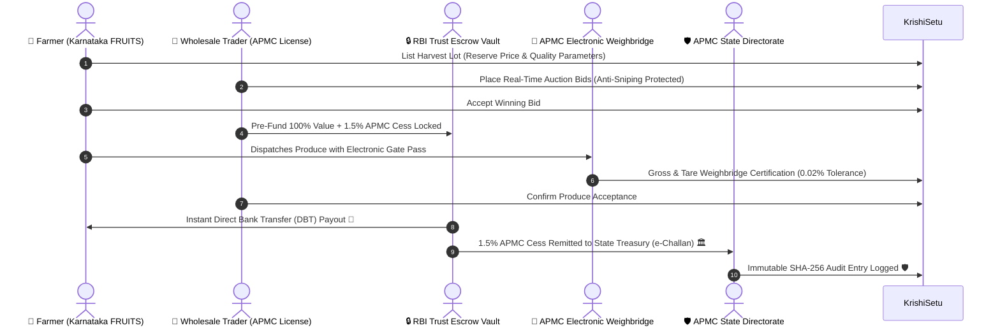

# 🌾 KrishiSetu (ಕರ್ನಾಟಕ ಕೃಷಿಸೇತು) — Smart APMC Direct Market Facilitation Platform

[](https://github.com/sameekshyaranjan/KrishiSetu)
[-blue?style=for-the-badge)](https://github.com/sameekshyaranjan/KrishiSetu)
[](https://github.com/sameekshyaranjan/KrishiSetu)
[](https://github.com/sameekshyaranjan/KrishiSetu)

> **KrishiSetu** is an enterprise-grade fullstack agricultural marketplace and statutory market facilitation suite engineered specifically for Karnataka's Agricultural Produce Market Committees (APMC). It directly connects verified producers (Farmers & FPOs) with licensed wholesale trading firms, eliminating predatory intermediaries, automating escrow financial security, enforcing statutory APMC market fees (1.5%), and enabling real-time commodity trading with 24-hour Direct Bank Transfers (DBT).

---

## 🏛️ Platform Architecture & Complete Trade Lifecycle



---

## 🌟 Key Fullstack Features (All 150 Stages Implemented)

### 🌾 1. Farmer & FPO Portal (`/farmer/*`)
- **Karnataka AgriStack FRUITS ID Integration:** Automated verification against Bhoomi RTC land records across Hassan, Mandya, Belagavi, Kolar, and Bengaluru Rural.
- **Smart Crop Listing Wizard (`FarmerListings.jsx`):** 3-step listing with real-time modal price benchmarks, reserve pricing, and automated countdown timers.
- **Live Auction Bid Manager (`FarmerBids.jsx`):** Real-time bid feeds with instant accept/reject controls and WhatsApp/SMS share triggers.
- **4-Stage Order Logistics Pipeline (`FarmerOrders.jsx`):** End-to-end fulfillment tracking (*Pending Weighbridge ➔ In Transit ➔ Delivered ➔ Payout Released*).
- **Doppler Weather Radar & IMD Advisories (`FarmerWeather.jsx`):** Real-time Open-Meteo telemetry across 14 Karnataka districts with crop-specific spray advisories.

### 💼 2. Wholesale Trader Portal (`/trader/*`)
- **Commodity Marketplace Terminal (`TraderMarketplace.jsx`):** Filter by Karnataka APMC yard, category, quality grade, and real-time highest bid.
- **Interactive Bidding Engine (`TraderCropDetails.jsx`):** Anti-sniping soft-close protection (+5 min extensions) and instant 1-click counter-bidding (+₹50, +₹100/Qtl).
- **Virtual Escrow Trust Wallet (`TraderEscrow.jsx`):** RBI-compliant trust account management, upfront escrow locking, and automated refund mechanisms.
- **Procurement Logistics Hub (`TraderOrders.jsx`):** Electronic gate pass generation, truck tare weight certification, and delivery acceptance confirmation.

### 🛡️ 3. APMC Admin & Governance Suite (`/admin/*`)
- **Statutory Quality Dispute Tribunal (`AdminDisputes.jsx`):** Binding arbitration docket with assayer laboratory certification and 85/15 mutual compromise splits.
- **Price Surveillance & Buffer Requisitions (`AdminPriceIntelligence.jsx`):** 7-day price surge alerts, MSP deficit floor protection, and KSWC silo buffer stock management.
- **Mandi Gate Telemetry & Weighbridge Audits (`AdminMandiMonitoring.jsx`):** Real-time truck gross/tare metrics, 0.02% Legal Metrology tolerance verification, and gate pass authorization.
- **Statutory 1.5% Cess Audit Ledger (`AdminCessAudits.jsx`):** Transaction-by-transaction market fee reconciliation and automated Karnataka State Treasury e-Challan generation.
- **Security Forensics & CAG Trail (`AdminAuditLogs.jsx`):** WORM-compliant, immutable SHA-256 cryptographic audit logs with raw JSON payload inspection.
- **Universal High-Volume Export Engine (`exportService.js`):** 1-Click RFC-4180 CSV exports with Microsoft Excel UTF-8 BOM encoding across all ledgers.

---

## 💻 Technology Stack

| Layer | Technologies |
|---|---|
| **Frontend UI** | React 19, Vite 8, Tailwind CSS v4, Lucide React, React Router v6, React Hot Toast |
| **Backend API** | Node.js (v18+), Express.js (v4), RESTful Architecture, Node-Cron, Multer |
| **Database & Cache** | MongoDB (Mongoose ORM), Redis (Upstash / In-Memory Session Blacklist) |
| **Real-Time Telemetry**| Socket.io WebSockets, CDAC e-Gov SMS Gateway Simulation, Open-Meteo API |
| **Security & Compliance**| JWT (JSON Web Tokens), Bcrypt.js, Helmet.js, SHA-256 Cryptographic Hash Chaining |
| **Data Export** | RFC-4180 CSV Streaming with UTF-8 BOM (`\uFEFF`), JSON Exporter |

---

## 🚀 Quick Start & Local Setup

### 1. Prerequisites
- Node.js (v18.0.0 or higher)
- Git
- MongoDB (Local or MongoDB Atlas)

### 2. Clone Repository
```bash
git clone https://github.com/sameekshyaranjan/KrishiSetu.git
cd KrishiSetu
```

### 3. Backend Setup
```bash
cd backend
npm install
```
Create `backend/.env`:
```env
PORT=5000
NODE_ENV=development
MONGO_URI=mongodb+srv://<user>:<password>@cluster.mongodb.net/krishisetu
JWT_SECRET=krishisetu_super_secret_jwt_key_2026
JWT_REFRESH_SECRET=krishisetu_super_secret_refresh_key_2026
REDIS_URL=redis://localhost:6379
```
Start Backend Server:
```bash
npm run dev
```
*(Backend runs on `http://localhost:5000`)*

### 4. Frontend Setup
In a new terminal:
```bash
cd frontend
npm install
npm run dev
```
*(Frontend runs on `http://localhost:5173`)*

---

## 🔑 Demo Access Credentials

The platform includes pre-configured demo authentication buttons on the login screen (`/login`):

| Role | Email | Password | Primary Dashboard |
|---|---|---|---|
| 🌾 **Farmer / Producer** | `farmer1@krishisetu.com` | `password123` | `/farmer/listings` |
| 💼 **Wholesale Trader** | `trader1@krishisetu.com` | `password123` | `/trader/marketplace` |
| 🛡️ **APMC State Admin** | `admin@krishisetu.com` | `password123` | `/admin/disputes` |

---

## 📈 150-Stage Development Breakdown

```
Phase 1: Backend Foundation & AgriStack Database (Stages 1–30)
Phase 2: Core Trading Engine, Escrow Vault & 4-Stage Logistics (Stages 31–70.15)
Phase 3: Frontend Portal Suite for Farmers & Wholesale Buyers (Stages 71–115)
Phase 4: APMC Administrative Governance & Quality Arbitration (Stages 116–125)
Phase 5: Real-Time Telemetry, Socket.io & Doppler Radar (Stages 126–130)
Phase 6: Fullstack Axios Client, Dual-Sync Storage & High-Volume Export Engine (Stages 131–150)
```

---

## 📄 License & Regulatory Compliance

This project is engineered in strict compliance with the **Karnataka Agricultural Produce Marketing (Regulation and Development) Act** and **AgriStack India Digital Agriculture Guidelines**.

**Crafted with ❤️ for India's Agricultural Ecosystem 🌾🚜**
