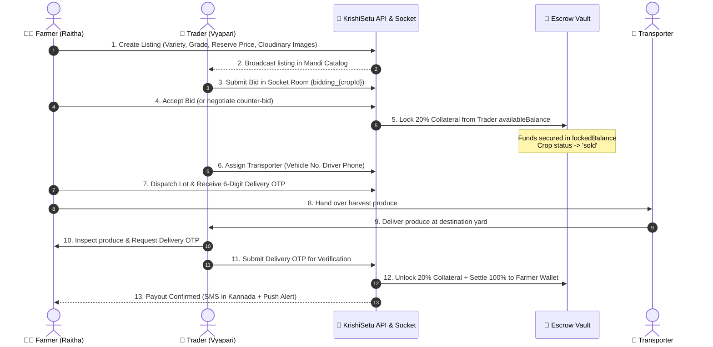

# 🌾 KrishiSetu (ಕರ್ನಾಟಕ ಕೃಷಿಸೇತು)
> **Next-Generation Direct-to-APMC Agritech Marketplace, Escrow Settlement Engine & Agro-Intelligence Platform**  
> *Target Jurisdiction: Karnataka, India (31 Agro-Climatic Districts) | Zero-Commission Peer-to-Peer Mandi Protocol*

[](https://nodejs.org/)
[](https://expressjs.com/)
[](https://react.dev/)
[](https://www.mongodb.com/)
[](https://redis.io/)
[](https://socket.io/)
[](https://tailwindcss.com/)
[](http://localhost:5000/api-docs)
[](LICENSE)

---

## 📑 Table of Contents
1. [Executive Summary & Problem Statement](#-1-executive-summary--problem-statement)
2. [Platform Mission & Value Proposition](#-2-platform-mission--value-proposition)
3. [Target Personas & Stakeholder Value Matrix](#-3-target-personas--stakeholder-value-matrix)
4. [Comprehensive Feature Catalog](#-4-comprehensive-feature-catalog)
5. [System Architecture & Data Flows](#-5-system-architecture--data-flows)
6. [Core Business Workflows & State Machines](#-6-core-business-workflows--state-machines)
7. [Technology Stack & Architectural Rationale](#-7-technology-stack--architectural-rationale)
8. [Authentication, Authorization & Security Engineering](#-8-authentication-authorization--security-engineering)
9. [Monorepo Codebase & Directory Structure](#-9-monorepo-codebase--directory-structure)
10. [RESTful & Dual API Endpoint Directory](#-10-restful--dual-api-endpoint-directory)
11. [Developer Local Setup & Quickstart Guide](#-11-developer-local-setup--quickstart-guide)
12. [Distributed Concurrency, Edge Cases & Self-Healing](#-12-distributed-concurrency-edge-cases--self-healing)
13. [Current Limitations & Future Roadmap](#-13-current-limitations--future-roadmap)
14. [License & Compliance](#-14-license--compliance)

---

## 🌾 1. Executive Summary & Problem Statement

### 1.1 The Karnataka APMC Crisis
In traditional Indian agricultural commerce—specifically regulated under Karnataka's Agricultural Produce Market Committee (APMC) yards—smallholder farmers face acute structural exploitation:

* **Predatory Intermediary Cartels**: Middlemen (*dalals* / commission agents) routinely levy **15% to 25%** commissions, controlling physical weigh-ins and bidding rings to depress purchase rates below fair market value.
* **Information Asymmetry**: Farmers lack cross-district market price transparency. For example, a tomato grower in Hassan may sell harvest at ₹12/kg while Mysuru or Bengaluru APMC mandis trade the identical crop variety at ₹24/kg on the exact same morning.
* **Payment Defaults & Post-Harvest Distress**: Buyers frequently delay settlements for **30 to 90 days** or force unilateral renegotiation on produce upon physical arrival at the mandi yard (*post-harvest distress selling*).
* **Arbitrary Deductions**: Unregulated deductions under the guise of "moisture loss", "handling charges", or "spoilage discounts" eat into already razor-thin farm profits.
* **Arbitration Gridlock**: In disputes regarding produce grading, transit delays, or broken contracts, farmers lack a transparent digital paper trail and access to swift judicial recourse.

### 1.2 The KrishiSetu Solution
**KrishiSetu** (Agricultural Bridge) is a production-grade, enterprise agritech marketplace and financial escrow settlement protocol engineered specifically to disintermediate agricultural trade in Karnataka. It replaces opaque physical broker rings with:

1. **Direct Digital Farmer-to-Trader Contracting**: Certified crop listings with mandi quality grading, reserve prices, and high-resolution Cloudinary media proof.
2. **Dual-Lock Escrow Vault**: 20% collateral upfront capital freeze inside the trader's digital wallet upon bid acceptance, guaranteeing solvency before transport begins.
3. **Cryptographic 6-Digit Delivery OTP Handshake**: Funds remain protected in escrow until produce is physically inspected and the farmer releases a cryptographically verified delivery OTP.
4. **Quasi-Judicial APMC Dispute Arbitration**: Standardized administrative docket with visual evidence inspection and automated ruling execution (100% refund, 85/15 compromise split, or 100% payout).
5. **Real-Time Agmarknet Mandi Telemetry**: Live mandi arrivals and pricing across all 31 Karnataka districts with automated threshold price alert background jobs.

```
+-----------------------+                         +---------------------------+
|  Smallholder Farmer   | <=== Direct Contract => |  Licensed Mandi Trader    |
|   (Raitha / Seller)   |                         |     (Vyapari / Buyer)     |
+-----------------------+                         +---------------------------+
           ||                                                   ||
           ||====> [20% Upfront Capital Lock into Escrow] <====||
           ||                                                   ||
           v                                                     v
+-----------------------------------------------------------------------------+
|                           KrishiSetu APMC Engine                            |
|  * Double-Entry Wallet Ledger       * 48-Hour Inactive Auto-Reversion       |
|  * Real-Time Socket.io Bidding Room * 6-Digit Delivery OTP Verification     |
|  * Live Agmarknet Price Telemetry   * Administrative Dispute Docket         |
+-----------------------------------------------------------------------------+
```

---

## 🎯 2. Platform Mission & Value Proposition

* **Empowering the Farmer (Zero Commission)**: KrishiSetu levies 0% listing or brokerage fees on farmers, returning 100% of the agreed contract value directly to rural producers.
* **Securing the Buyer (Transparent Quality & Delivery)**: Traders gain access to verified produce grades (Grade A, B, C, Organic), exact harvest dates, geo-coordinates, and transparent vehicle tracking.
* **Regulatory Compliance**: Built strictly adhering to the Karnataka APMC (Regulation and Development) Act and India's **AgriStack** standardized digital agriculture frameworks.

---

## 👥 3. Target Personas & Stakeholder Value Matrix

| Persona | Role in Karnataka Mandi | Core KrishiSetu Capabilities | Key Business Benefit |
|---|---|---|---|
| **🧑‍🌾 Farmer (Raitha)** | Crop producer & seller across Karnataka's rural agro-climatic belts | • List crops with photo proof, weight, grade, & reserve price<br>• Real-time bilateral bidding & counter-negotiation<br>• Track logistics & dispatch produce<br>• Verify delivery via 6-digit cryptographic OTP<br>• Receive multilingual SMS (Kannada, Hindi, English) | Guaranteed payout, zero middleman cuts, real-time APMC price transparency, protection against post-delivery renegotiations. |
| **🏢 Trader (Vyapari)** | Licensed bulk buyer, food processor, or mandi wholesale merchant | • Search & filter verified crop lots by district and grade<br>• Fund multi-tier digital wallet via UPI/Netbanking simulation<br>• Submit binding bids and counter-offers<br>• Assign transporter & submit vehicle details<br>• Raise quality disputes with photo evidence | Direct sourcing from farm gate, verified harvest batches, transparent escrow protection, automated logistics coordination. |
| **⚖️ APMC Admin & Arbiter** | Karnataka state market yard regulatory officer & quality inspector | • Quasi-judicial dispute arbitration docket<br>• Review high-resolution visual evidence & inspection logs<br>• Issue binding rulings (100% refund, 85/15 split, 100% release)<br>• Broadcast government schemes (PM-KISAN, Raitha Siri)<br>• Monitor district-level mandi trade turnover analytics | Complete auditability, elimination of unlawful physical market cartelization, regulatory compliance, dispute resolution SLA < 48 hours. |

---

## 🚀 4. Comprehensive Feature Catalog

### 4.1 Direct Crop Marketplace & Batch Registry
* **Multi-Attribute Listings**: Crop title, category (Grains, Pulses, Vegetables, Fruits, Oilseeds, Spices), variety, total quantity (Quintals/Kg), reserve minimum price, and harvest date.
* **Quality Grade Classification**: Standardized APMC quality indicators (Grade A - Premium Export, Grade B - Mandi Standard, Grade C - Processing, Organic Certified).
* **Cloudinary Media Pipeline**: High-resolution image capture with authenticated CDN delivery, thumbnail generation, and responsive full-screen lightbox preview.
* **District & Mandi Geo-Filtering**: Instant discovery filtered across Karnataka's 31 districts (Hassan, Mysuru, Mandya, Belagavi, Kolar, Shivamogga, etc.).

### 4.2 Real-Time APMC Bidding & Counter-Negotiation Engine
* **High-Concurrency WebSocket Rooms**: Every listing operates a dedicated Socket.io room (`bidding_{cropId}`), broadcasting bids, outbid alerts, and counter-offers with sub-50ms latency.
* **Bilateral Counter-Offer Lifecycle**: Both farmer and trader can exchange counter-offers with visual price-delta trails until mutual agreement or rejection.
* **15-Minute Undo Cooling-Off Window**: Farmers have a 15-minute grace period to undo an accidental bid acceptance (`undoAcceptBid`) before logistics lock in.
* **48-Hour Auto-Reversion Engine**: If an accepted bid is not funded or progressed by the buyer within 48 hours, a distributed BullMQ worker automatically cancels the order, flags the buyer with a strike penalty, and restores the crop listing to `available`.

### 4.3 Multi-Tier Wallet & Escrow Ledger System
* **Two-Tier Balance Architecture**:
  * `availableBalance`: Liquid capital available for new bids, withdrawals, or top-ups.
  * `lockedBalance`: Capital legally locked in escrow under active purchase contracts.
* **20% Upfront Escrow Collateral**: Upon bid acceptance, 20% of the total order value is atomically transferred from `availableBalance` to `lockedBalance`.
* **Double-Entry Financial Journal**: Every balance alteration is backed by an immutable record in `WalletLedger` with audit tags (`DEPOSIT`, `ESCROW_LOCK`, `ESCROW_RELEASE`, `ESCROW_REFUND`, `PENALTY`).
* **Atomic MongoDB Arithmetic**: All monetary transactions use `$inc` with balance precondition assertions to mathematically prevent double-spending and overdrafts.

### 4.4 Geo-Logistics, Transporter Assignment & 6-Digit OTP Handshake
* **Transporter Assignment**: Trader assigns logistics partner with driver name, contact phone number, vehicle registration number, and estimated arrival date.
* **Dispatch Lot Workflow**: Farmer marks lot as dispatched upon vehicle loading.
* **Cryptographic 6-Digit Delivery OTP**: A secure one-time passcode generated upon dispatch. The buyer inspects produce at the delivery destination and provides the OTP to the driver/farmer.
* **Settlement Execution**: Submitting the correct OTP immediately finalizes the contract, transitions the order to `completed`, releases the escrow funds directly into the farmer's wallet, and issues an immutable transaction receipt.

### 4.5 APMC Dispute Arbitration Docket & Evidence Vault
* **Dispute Elevation**: Either party can elevate an order to dispute status prior to final OTP confirmation for reasons like *Quality Discrepancy*, *Moisture Exceeds Grade Tolerance*, *Quantity Shortage*, or *Transit Damage*.
* **Evidence Vault**: Secure upload of delivery receipts, weighbridge slips, and photographic proof of defective produce.
* **Administrative Quasi-Judicial Rulings**:
  1. `refund_trader`: 100% immediate capital refund from `lockedBalance` to trader's `availableBalance`; crop is marked defective/delisted.
  2. `payout_farmer`: 100% capital release from `lockedBalance` to farmer's wallet upon delivery verification.
  3. `split_85_15`: Mandi-standard compromise settlement awarding 85% of contract value to the farmer and returning 15% to the trader for grade rectification.

### 4.6 Live Agmarknet Mandi Pricing & Price Alerts
* **Govt API Integration**: Ingests real-time agricultural mandi arrivals and price points (Minimum, Maximum, Modal) from `data.gov.in` across Karnataka APMCs.
* **Compound Deduplication**: Indexed by `(market, commodity, variety, arrivalDate)` to maintain historical price curves without duplicate records.
* **Automated Price Alerts**: Farmers set price thresholds on specific crops. A recurring BullMQ cron evaluates real-time market arrivals and triggers instant in-app and SMS notifications when market rates exceed the farmer's target.

### 4.7 Multilingual SMS Engine & Real-Time Alerts
* **Twilio SMS Gateway**: Production SMS dispatch supporting regional languages:
  * 🟡 **Kannada (ಕನ್ನಡ)**: Localized templates for Karnataka farmers.
  * 🔵 **Hindi (हिंदी)**: Standard national agricultural terminology.
  * ⚪ **English**: Formal trade receipts and administrative notices.
* **Dual In-App Notification Center**: WebSocket push alerts with persistent MongoDB storage, unread counters, and mark-as-read toggles.

### 4.8 Government Schemes & Subsidies Registry
* Comprehensive agricultural schemes registry covering central and Karnataka state initiatives:
  * *PM-KISAN (Pradhan Mantri Kisan Samman Nidhi)*
  * *Raitha Siri (Millet Cultivation Incentive)*
  * *Krishi Bhagya (Farm Ponds & Micro Irrigation)*
  * *Pashu Bhagya (Livestock Rearing Subsidies)*
* Searchable and filterable with eligibility requirements, subsidy percentages, and direct government application portal links.

### 4.9 Executive Analytics & APMC Mandi Regulatory Reports
* Real-time metrics tracking total platform gross merchandise value (GMV), active crop listings, completed trade contracts, and open dispute counts.
* One-click export of structured mandi records into **Excel (.xlsx)** and **PDF** formats for regulatory APMC yard auditing.

---

## 🏗️ 5. System Architecture & Data Flows

### 5.1 Architectural Topology
KrishiSetu is structured as a high-performance decoupled client-server architecture with an asynchronous worker pipeline and distributed in-memory cache:

```
+-----------------------------------------------------------------------------------+
|                                 CLIENT TIER                                       |
|  * React 19 SPA (Vite 8)                     * React Router v7                    |
|  * APMC Emerald UI Design Tokens             * Socket.io-client Real-Time Duplex  |
|  * Axios HTTP Client with JWT Interceptors    * Lucide Reactive Agricultural Icons |
+-----------------------------------------------------------------------------------+
                                         |
                                HTTPS / WSS Requests
                                         v
+-----------------------------------------------------------------------------------+
|                                 GATEWAY & API TIER                                |
|  * Express 5.2 Runtime on Node.js 20+         * Helmet HTTP Protection             |
|  * Tiered Rate Limiters (Global, Auth, Admin) * Mongo Sanitize & HPP Defense       |
|  * Dual Route Routing: /api/* and /api/v1/*   * Swagger OpenAPI 3.0 (/api-docs)    |
|  * Socket.io Gateway (Rooms: bidding, order, user, dispute)                       |
+-----------------------------------------------------------------------------------+
          |                                  |                           |
          v                                  v                           v
+--------------------+            +--------------------+        +-------------------+
|   PERSISTENCE      |            |   CACHE & QUEUE    |        | EXTERNAL SERVICES |
|  MongoDB 7.0+      |            |  Redis 7.0+        |        |  * Twilio SMS     |
|  * Mongoose 9.6    |            |  * BullMQ 5.79     |        |  * Cloudinary CDN |
|  * 2dsphere Geo    |            |  * Repeatable Jobs |        |  * Data.gov.in    |
|  * Double Ledger   |            |  * Fallback Mock   |        |  * OpenWeatherMap |
+--------------------+            +--------------------+        +-------------------+
```

### 5.2 Dual API Routing & Versioning Strategy
KrishiSetu implements a dual-routing architecture in `backend/server.js`. All service routes are simultaneously mounted under both paths:
* `/api/*`: Backwards-compatible legacy access for web client modules.
* `/api/v1/*`: Standardized, enterprise versioned REST endpoints for API consumers and future mobile clients.

### 5.3 Asynchronous BullMQ & Redis Job Pipeline
To ensure sub-second API response times and zero blocking on long-running tasks, KrishiSetu delegates heavy compute to BullMQ distributed queues:
1. `priceAlertQueue`: Executes every 30 minutes, evaluating active farmer price alerts against Agmarknet mandi arrivals.
2. `bidExpiryQueue`: Scans accepted bids every 60 minutes. Cancels unpaid contracts exceeding 48 hours and penalizes non-compliant traders.
3. `smsNotificationQueue`: Handles asynchronous SMS dispatch with retry backoff to prevent third-party gateway latency from stalling HTTP request threads.
4. *Graceful In-Memory Fallback*: If external Redis is unreachable, `ioredis-mock` automatically activates, ensuring 100% development continuity without crashing.

---

## 🔄 6. Core Business Workflows & State Machines

### 6.1 Crop Listing to Contract Settlement Lifecycle
The full lifecycle of an agricultural trade on KrishiSetu from farm harvest to wallet settlement:



### 6.2 Dispute Arbitration State Machine
When produce grade, weight, or quality does not match contract specifications:

```
[Active Contract] ===> (Dispute Raised with Photo Proof) ===> [STATUS: DISPUTED]
                                                                    ||
                                                                    v
                                                     [APMC Admin Docket Review]
                                                     (Inspector Examines Evidence)
                                                                    ||
                      +---------------------------------------------+---------------------------------------------+
                      |                                             |                                             |
                      v                                             v                                             v
              [refund_trader]                                [split_85_15]                                 [payout_farmer]
          • 100% Escrow Refund to Buyer                 • 85% Escrow Released to Farmer              • 100% Escrow Released to Farmer
          • Crop Listing Delisted                       • 15% Refunded to Buyer for Defect           • Order Marked Completed
          • Strike Issued if Fraudulent                 • Order Settled on Delivery                  • Dispute Closed
```

---

## 🛠️ 7. Technology Stack & Architectural Rationale

| Layer | Technology | Selected Version | Architectural Rationale & Why It Was Chosen |
|---|---|---|---|
| **Frontend Framework** | React | `^19.0.0` | Concurrent rendering engine, optimal Virtual DOM diffing, modern Hook architecture for reactive state. |
| **Build Tool** | Vite | `^8.0.0` | Lightning-fast Hot Module Replacement (HMR) and optimized Rollup tree-shaken production bundles. |
| **Routing** | React Router | `^7.13.0` | Declarative route hierarchy, nested layout wrappers, and dynamic role-based route guarding. |
| **Design System** | Tailwind CSS | `^3.4.17` | High-performance utility-first CSS; zero runtime overhead with custom APMC Emerald agricultural palette. |
| **Icons & UI** | Lucide React | `^1.16.0` | Clean, lightweight SVG icon set optimized for responsive mobile agricultural interfaces. |
| **Backend Runtime** | Node.js | `v20.x+` | Asynchronous, non-blocking event-driven I/O ideal for high-throughput bidding transactions. |
| **Web Framework** | Express.js | `^5.2.1` | Modern Express 5 with native Promise rejection handling, robust routing, and extensive middleware ecosystem. |
| **Database** | MongoDB & Mongoose | `v7.0+` / `^9.6.3` | Flexible document model for varied agricultural crops, 2dsphere geospatial indexing, and atomic document mutations. |
| **In-Memory Cache** | Redis & ioredis | `v7.0+` / `^5.9.3` | High-speed cache for session state, distributed rate limiting, and pub/sub message brokers. |
| **Distributed Queue** | BullMQ | `^5.79.2` | Redis-backed distributed task queue with cron scheduling, automatic retries, backoff strategies, and concurrency control. |
| **WebSocket Engine** | Socket.io | `^4.8.3` | Sub-50ms bidirectional transport with automated fallback to HTTP long-polling and granular room isolation. |
| **Media Storage** | Cloudinary SDK | `^2.9.0` | Offloaded image transformations, WebP compression, secure signed uploads, and global CDN delivery. |
| **SMS Gateway** | Twilio SDK | `^5.12.0` | Carrier-grade SMS delivery with international unicode support for native Kannada (ಕನ್ನಡ) script. |
| **API Documentation** | Swagger UI Express | `^5.0.1` | Interactive OpenAPI 3.0 documentation generated dynamically from JSDoc specifications at `/api-docs`. |

---

## 🔒 8. Authentication, Authorization & Security Engineering

### 8.1 Authentication & Session Architecture
* **Stateless JWT Security**: Issues a signed JSON Web Token upon credential verification (`authController.js`) containing `{ id, role, district }` with a 24-hour expiration window.
* **Dual Header & Cookie Transport**: Auth tokens are accepted via both standard `Authorization: Bearer <token>` request headers and secure, HTTP-only, SameSite cookies.
* **Bcrypt Password Salting**: Passwords salted with 10 rounds of cryptographic hashing; raw passwords are never logged or stored in plaintext.

### 8.2 Role-Based Access Control (RBAC)
Endpoints are strictly protected via a two-layer middleware pipeline:
1. `protect`: Verifies token authenticity, extracts payload, and hydrates `req.user` from database.
2. `authorize(...roles)`: Enforces granular role permissions:
   * `farmer`: Allowed to list crops, view received bids, negotiate, and dispatch orders.
   * `trader`: Allowed to deposit funds, place bids, assign transporters, and confirm delivery.
   * `admin`: Allowed to arbitrate disputes, manage schemes, and access state-wide turnover analytics.

### 8.3 Production Security Hardening
* **Helmet Security Headers**: Automatically applies HTTP security headers (X-Frame-Options, X-Content-Type-Options, Strict-Transport-Security, and tuned Content Security Policies).
* **Tiered Rate Limiting**:
  * Global API Limiter: Prevents volumetric DDoS attacks across public routes.
  * Auth Route Limiter: Restricts login and registration attempts to prevent brute-force attacks.
  * Dispute & Bidding Limiters: Protects high-value transaction endpoints from automated bots.
* **NoSQL Injection Defense**: `express-mongo-sanitize` scrubs request payloads, stripping prohibited MongoDB operators (`$`, `$gt`, `$ne`).
* **HTTP Parameter Pollution (HPP)**: Prevents HTTP query parameter tampering attacks.

---

## 📁 9. Monorepo Codebase & Directory Structure

```
KrishiSetu/
├── backend/                         # Express 5 / Node.js Backend API
│   ├── config/                      # Infrastructure & Service Connectors
│   │   ├── db.js                    # Mongoose MongoDB Connection Pool
│   │   ├── redis.js                 # Redis Client & ioredis-mock Fallback
│   │   └── swagger.js               # OpenAPI 3.0 JSDoc Specifications
│   ├── controllers/                 # Business Logic & Request Handlers
│   │   ├── adminController.js       # Dispute Arbitration & Platform Analytics
│   │   ├── authController.js        # Authentication & Session Management
│   │   ├── bidController.js         # Real-Time Bidding & 48-Hour Reversion
│   │   ├── cropController.js        # Crop Marketplace CRUD & Media Uploads
│   │   ├── exportController.js      # Excel & PDF Mandi Report Generation
│   │   ├── notificationController.js# Notification Lifecycle Handlers
│   │   ├── priceController.js       # Agmarknet Mandi Telemetry & Price Alerts
│   │   ├── schemeController.js      # Government Subsidies & Schemes Registry
│   │   ├── storageController.js     # Geospatial Cold Storage Facilities
│   │   ├── transactionController.js # Orders, Logistics, & 6-Digit Delivery OTP
│   │   └── walletController.js      # Escrow Balance Locks & Ledger Audits
│   ├── jobs/                        # Background Task Scheduling
│   │   ├── bidExpiryJob.js          # 48-Hour Unpaid Bid Cancellation Worker
│   │   ├── priceAlertJob.js         # Agmarknet Mandi Price Threshold Worker
│   │   └── queueManager.js          # BullMQ Queue Definitions & Lifecycle
│   ├── middleware/                  # Request Interceptors & Security Filters
│   │   ├── auth.js                  # JWT Token Verification & RBAC Guards
│   │   ├── errorHandler.js          # Global Exception Formatter
│   │   └── rateLimiter.js           # Tiered Express Rate Limiters
│   ├── models/                      # MongoDB Schemas & Validation Rules
│   │   ├── Bid.js                   # Bidding Records & Counter-Offer Trail
│   │   ├── ColdStorage.js           # 2dsphere GeoJSON Storage Facilities
│   │   ├── Crop.js                  # Crop Listings, Grades, & Reserve Prices
│   │   ├── Dispute.js               # Quasi-Judicial APMC Arbitration Records
│   │   ├── MandiPrice.js            # Agmarknet Market Arrival Telemetry
│   │   ├── Notification.js          # In-App User Alerts & Event Logs
│   │   ├── PriceAlert.js            # User Crop Price Threshold Watchlists
│   │   ├── Scheme.js                # Government Agricultural Welfare Programs
│   │   ├── Transaction.js           # Order Contracts & Delivery OTP Hashes
│   │   ├── User.js                  # User Identity, District, & Role Enums
│   │   ├── Wallet.js                # availableBalance & lockedBalance Records
│   │   └── WalletLedger.js          # Immutable Double-Entry Audit Logs
│   ├── routes/                      # API Endpoint Route Declarations
│   ├── seedData.js                  # Database Seeding Script with Demo Records
│   └── server.js                    # HTTP Server Bootstrapper & Socket.io Hub
│
├── frontend/                        # React 19 / Vite Single Page Application
│   ├── public/                      # Static Assets & Web Manifest
│   ├── src/
│   │   ├── assets/                  # Brand Imagery & Graphical Badges
│   │   ├── components/              # Modular Reusable UI Components
│   │   │   ├── AdminDisputeCard.jsx # Quasi-Judicial Evidence & Ruling Card
│   │   │   ├── CropCard.jsx         # Mandi Listing Preview Tile
│   │   │   ├── Footer.jsx           # Platform Footer with Quick Links
│   │   │   ├── Navbar.jsx           # Dynamic Role-Based Top Navigation
│   │   │   ├── NotificationBell.jsx # Real-Time Socket.io Alert Popover
│   │   │   └── ProtectedRoute.jsx   # Client-Side RBAC Route Interceptor
│   │   ├── context/                 # Reactive Global State Providers
│   │   │   ├── AuthContext.jsx      # User Identity & Token Management
│   │   │   └── SocketContext.jsx    # Real-Time WebSocket Connection State
│   │   ├── pages/                   # Application Screen Views
│   │   │   ├── AdminDashboard.jsx   # APMC Regulatory Analytics & Controls
│   │   │   ├── AdminDisputes.jsx    # Dispute Arbitration Docket View
│   │   │   ├── CropDetails.jsx      # Detailed Crop View & Bidding Console
│   │   │   ├── FarmerDashboard.jsx  # Farmer Harvest Listings & Bid Inbox
│   │   │   ├── Home.jsx             # Public Landing Page & Market Ticker
│   │   │   ├── Login.jsx            # Authenticated User Login Form
│   │   │   ├── MandiPrices.jsx      # Live Karnataka Agmarknet Price Board
│   │   │   ├── Orders.jsx           # Order Tracking, Logistics & OTP Handshake
│   │   │   ├── Register.jsx         # User Onboarding & District Selection
│   │   │   ├── Schemes.jsx          # Government Welfare Schemes Portal
│   │   │   ├── TraderDashboard.jsx  # Trader Procurement & Active Bids
│   │   │   └── Wallet.jsx           # Escrow Balance & Transaction History
│   │   ├── services/                # API Communication Layer
│   │   │   ├── api.js               # Central Axios Client with Bearer Token Injection
│   │   │   └── socket.js            # Socket.io Event Helpers
│   │   ├── App.jsx                  # Main Application Layout & Router
│   │   ├── index.css                # Tailwind CSS Directives & Custom Utilities
│   │   └── main.jsx                 # React 19 Entrypoint
│   ├── tailwind.config.js           # APMC Emerald Palette & Design Tokens
│   └── vite.config.js               # Vite Bundler Build Configuration
│
└── README.md                        # Master Project Documentation (This File)
```

---

## 📡 10. RESTful & Dual API Endpoint Directory

All endpoints are registered under both `/api/*` and `/api/v1/*`. Interactive Swagger documentation is accessible locally at:  
👉 **`http://localhost:5000/api-docs`**

| Module | HTTP Method | Endpoint Path | Access Level | Description |
|---|---|---|---|---|
| **Authentication** | `POST` | `/auth/register` | Public | Register new User (`farmer`, `trader`, `admin`) |
| | `POST` | `/auth/login` | Public | Authenticate credentials & return signed JWT |
| | `GET` | `/auth/me` | Authenticated | Retrieve authenticated user profile |
| **Crops** | `GET` | `/crops` | Public | Browse listings with category, district, & grade filters |
| | `POST` | `/crops` | Farmer | Create new crop listing with Cloudinary image uploads |
| | `GET` | `/crops/:id` | Public | Retrieve detailed crop metadata and active bids |
| | `DELETE` | `/crops/:id` | Farmer / Admin | Delist crop listing from marketplace |
| **Bidding** | `POST` | `/bids` | Trader | Submit a competitive bid on an active listing |
| | `GET` | `/bids/crop/:cropId` | Authenticated | View all bids placed on a specific crop |
| | `PUT` | `/bids/:id/accept` | Farmer | Accept bid, transition crop to `sold`, lock 20% escrow |
| | `PUT` | `/bids/:id/counter` | Farmer / Trader | Submit counter-offer with revised pricing |
| | `POST` | `/bids/:id/undo` | Farmer | Undo bid acceptance within 15-minute cooling window |
| **Wallet & Escrow** | `GET` | `/wallet/balance` | Authenticated | Retrieve `availableBalance` and `lockedBalance` |
| | `POST` | `/wallet/deposit` | Trader | Deposit liquid funds into wallet |
| | `GET` | `/wallet/transactions` | Authenticated | View double-entry ledger audit trail (`WalletLedger`) |
| **Orders & Logistics** | `GET` | `/transactions/my-orders` | Authenticated | List all active purchase orders and delivery contracts |
| | `PUT` | `/transactions/:id/transporter` | Trader | Assign driver phone, vehicle number, and dispatch date |
| | `PUT` | `/transactions/:id/dispatch` | Farmer | Mark lot dispatched; generate 6-digit cryptographic OTP |
| | `PUT` | `/transactions/:id/delivery` | Trader | Submit 6-digit delivery OTP; release escrow to farmer |
| **Disputes** | `POST` | `/transactions/:id/dispute` | Farmer / Trader | Elevate order to dispute with photo evidence |
| | `GET` | `/admin/disputes` | Admin | View state-wide quasi-judicial dispute docket |
| | `PUT` | `/admin/disputes/:id/resolve` | Admin | Execute ruling (`refund_trader`, `split_85_15`, `payout_farmer`) |
| **Mandi Intelligence** | `GET` | `/prices/current` | Public | Real-time Agmarknet commodity arrivals across Karnataka |
| | `POST` | `/prices/alert` | Farmer | Register price threshold alert for background worker |
| **Schemes** | `GET` | `/schemes` | Public | List government agricultural schemes and subsidies |
| | `POST` | `/schemes` | Admin | Create or update state welfare programs |
| **Export & Admin** | `GET` | `/export/excel` | Admin | Export APMC mandi trade reports in Excel format |
| | `GET` | `/export/pdf` | Admin | Generate formatted PDF market summary statement |
| | `GET` | `/health` | Public | System liveness probe & database connection healthcheck |

---

## 💻 11. Developer Local Setup & Quickstart Guide

### 11.1 System Prerequisites
* **Node.js**: `v20.x` or higher (`v24.x` supported)
* **MongoDB**: Local Community Server `v7.0+` OR MongoDB Atlas Connection URI
* **Redis**: Local Redis Server `v7.0+` OR Redis Cloud URL *(Optional: in-memory mock activates if absent)*
* **Git**: Installed and configured

### 11.2 Step-by-Step Installation

#### Step 1: Clone the Repository
```bash
git clone https://github.com/sameekshyaranjan/KrishiSetu.git
cd KrishiSetu
```

#### Step 2: Configure Environment Variables
Create the backend environment file:
```bash
# Create backend/.env
cat << 'EOF' > backend/.env
PORT=5000
NODE_ENV=development
MONGO_URI=mongodb://127.0.0.1:27017/krishisetu
JWT_SECRET=super_secret_jwt_key_krishisetu_2026
JWT_REFRESH_SECRET=super_secret_refresh_jwt_key_krishisetu_2026
CLIENT_URL=http://localhost:5173
SERVER_URL=http://localhost:5000
USE_REDIS=false
REDIS_URL=redis://127.0.0.1:6379
RAZORPAY_KEY_ID=dummy_key_id
RAZORPAY_KEY_SECRET=dummy_key_secret
CLOUDINARY_CLOUD_NAME=dummy_cloud
CLOUDINARY_API_KEY=dummy_key
CLOUDINARY_API_SECRET=dummy_secret
TWILIO_ACCOUNT_SID=dummy_sid
TWILIO_AUTH_TOKEN=dummy_token
TWILIO_PHONE_NUMBER=+1234567890
AGMARKNET_API_KEY=dummy_key_for_now
EOF
```

Create the frontend environment file:
```bash
# Create frontend/.env
cat << 'EOF' > frontend/.env
VITE_API_URL=http://localhost:5000/api
VITE_SOCKET_URL=http://localhost:5000
EOF
```

#### Step 3: Install Backend Dependencies & Seed Sample Data
```bash
cd backend
npm install

# Seed verified test accounts, active listings, mandi prices, and government schemes
npm run seed
```

#### Step 4: Launch the Backend API Server
```bash
# Start backend server with nodemon auto-reloading
npm run dev
# Server boots on: http://localhost:5000
# OpenAPI Swagger UI: http://localhost:5000/api-docs
```

#### Step 5: Launch the Frontend Client (In a New Terminal)
```bash
cd frontend
npm install
npm run dev
# Frontend boots on: http://localhost:5173
```

### 11.3 Verified Demo Test Accounts
The database seeding script (`npm run seed`) provisions pre-configured test profiles ready for immediate platform evaluation:

| Role | Email Address | Password | Name & Location Profile | Pre-Funded State |
|---|---|---|---|---|
| **🧑‍🌾 Farmer** | `farmer1@krishisetu.com` | `password123` | Ramesh Gowda (Hassan District) | Active listings seeded (Hassan Tomatoes, Grade A) |
| **🏢 Trader** | `trader1@krishisetu.com` | `password123` | Karnataka Agro Traders (Bengaluru Urban) | Funded wallet with ₹50,000 liquid available balance |
| **⚖️ Admin** | `admin@krishisetu.in` | `admin123` | State APMC Mandi Regulatory Officer | Full access to Dispute Docket & System Analytics |

---

## 🛡️ 12. Distributed Concurrency, Edge Cases & Self-Healing

### 12.1 Double-Acceptance Concurrency Race
* **Problem**: A farmer receives simultaneous competitive bids and attempts to accept both from multiple devices at the exact same millisecond.
* **Resolution**: Enforced atomically in `bidController.js` via MongoDB's atomic document selector:
  ```javascript
  const updatedCrop = await Crop.findOneAndUpdate(
    { _id: bid.crop, status: 'available' },
    { $set: { status: 'sold' } },
    { new: true }
  );
  if (!updatedCrop) {
    return res.status(400).json({ success: false, message: 'Crop listing is no longer available' });
  }
  ```
  Only one atomic mutation can succeed. The concurrent request matches zero documents and safely aborts.

### 12.2 Escrow Insolvency During Multi-Bid Acceptance
* **Problem**: A trader places bids on 5 distinct listings with ₹20,000 total balance. Two farmers accept simultaneously, but each requires ₹15,000 escrow collateral (totaling ₹30,000).
* **Resolution**: Handled atomically using a balance condition assertion:
  ```javascript
  const wallet = await Wallet.findOneAndUpdate(
    { trader: bid.trader, availableBalance: { $gte: lockAmount } },
    { 
      $inc: { availableBalance: -lockAmount, lockedBalance: lockAmount } 
    },
    { new: true }
  );
  if (!wallet) {
    // Rollback crop listing status to available
    await Crop.findByIdAndUpdate(bid.crop, { status: 'available' });
    return res.status(400).json({ success: false, message: 'Trader has insufficient funds for escrow lock' });
  }
  ```

### 12.3 Graceful Infrastructure Degradation
* If Redis Cloud goes offline, `ioredis-mock` transparently intercepts queue operations, ensuring HTTP REST endpoints, authentication, and bidding workflows function seamlessly.
* Global process exception hooks in `server.js` capture unhandled promise rejections and network socket disconnects without dropping the running Node.js process.

---

## 🔮 13. Current Limitations & Future Roadmap

* [ ] **AgriStack & ONDC Federation**: Direct national digital identity integration with India's AgriStack Farmer ID registry and ONDC open commerce protocol.
* [ ] **Offline PWA Support**: Service Worker offline caching for rural Karnataka regions with intermittent 2G/3G cellular connectivity.
* [ ] **IoT Moisture & Weighbridge Telemetry**: Hardware sensor integration for automated moisture content readings and digital weighbridge ticket ingestion.
* [ ] **Native Mobile Application**: Cross-platform mobile app built with React Native / Flutter for seamless on-field camera uploads and push notifications.
* [ ] **Multi-Mandi Logistics Pooling**: Shared freight vehicle matching for smallholder farmers transporting produce to the same district APMC market yard.

---

## 📜 14. License & Compliance

### 14.1 Legal & Regulatory Compliance
* **Karnataka APMC Act**: Aligned with the provisions of the Karnataka Agricultural Produce Marketing (Regulation and Development) Act for electronic market facilitation and farmer protections.
* **RBI Escrow Guidelines**: Escrow simulation designed in adherence with Reserve Bank of India directions for electronic intermediary settlement accounts.

### 14.2 Open-Source License
Distributed under the **MIT License**. See `LICENSE` for complete terms and permissions.

---

### 👨‍💻 Project Maintainer & Contributors
* **Lead Engineer**: Sameekshya Ranjan
* **Repository**: [https://github.com/sameekshyaranjan/KrishiSetu](https://github.com/sameekshyaranjan/KrishiSetu)

*(c) 2026 KrishiSetu. Bridging Indian Agriculture with Modern Technology.*
